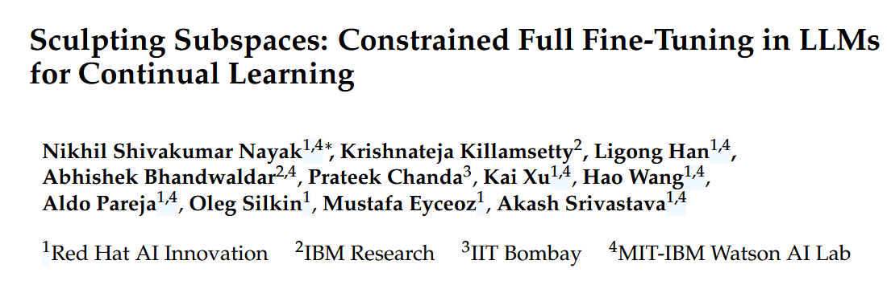
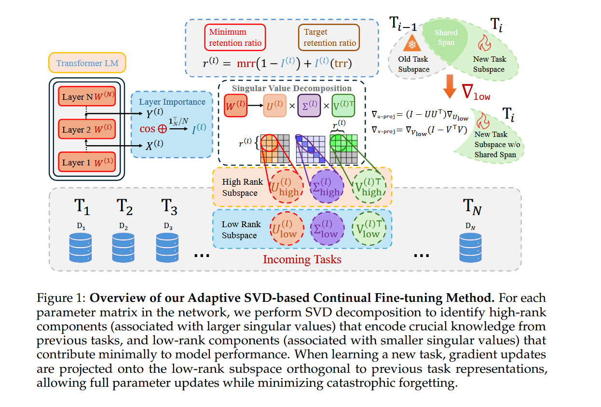

# 《Sculpting Subspaces: Constrained Full Fine-Tuning in LLMs for Continual Learning》论文总结

## 📌 Information



## 📌 Motivation

### 核心问题

想象一下，你是一个经验丰富的厨师，已经学会了做100道菜。现在你要学习第101道菜，但你的大脑容量有限——学习新菜谱时，你可能会忘记之前怎么做宫保鸡丁。这就是**灾难性遗忘**问题。

在大型语言模型(LLM)的持续学习场景中，这个问题更加突出：

**现实场景举例：**
- 🏢 **企业助手**：需要不断学习新产品、新政策，但不能忘记如何处理旧产品
- 🏥 **医疗AI**：需要吸收最新研究成果，但必须保留基础医学知识

### 现有方法的局限性

| 方法类型 | 比喻 | 缺陷 |
|---------|------|------|
| **LoRA/Adapter** | 给厨师配一个小本子记新菜谱 | 🚫 表达能力受限，只能学"简单菜谱" |
| **EWC/LwF** | 给厨师戴手铐，不许大幅改动 | 🚫 无法彻底避免干扰，逐渐遗忘 |
| **模型合并** | 雇佣多个厨师，最后强行融合 | 🚫 需要存储多个完整模型，计算成本高 |

### 核心洞察

神经网络权重矩阵存在**巨大冗余**：

> 就像一个巨大的图书馆，大部分书架都只放着很少的几本书（低秩方向），只有少数几个书架摆满了重要的书（高秩方向）。

**关键发现：** 
- 高奇异值方向 = 存储了旧任务的关键知识
- 低奇异值方向 = 冗余空间，可以用来学习新任务

---

## 🛠️ 方法总结

### 核心思想：SVD引导的自适应子空间雕刻

```
┌─────────────────────────────────────────────────┐
│  权重矩阵 W = U Σ V^T (SVD分解)                  │
├─────────────────────────────────────────────────┤
│  高奇异值方向 (大σ)  →  冻结保护  →  保留旧知识   │
│  低奇异值方向 (小σ)  →  投影更新  →  学习新任务   │
└─────────────────────────────────────────────────┘
```

### 关键步骤

#### 1️⃣ **SVD分解**
对每层权重矩阵 $W^{(l)}$ 进行奇异值分解：
$$W^{(l)} = U^{(l)} \Sigma^{(l)} (V^{(l)})^{\top}$$

**比喻：** 把一个多维空间按照"重要性"排序，就像把书架上的书按借阅次数排序。

#### 2️⃣ **层重要性计算**
$$I^{(l)} = \frac{1}{N}\sum_{i=1}^{N}\text{cosine\_similarity}(X_i^{(l)}, Y_i^{(l)})$$

其中 $Y_i^{(l)} = W^{(l)}X_i^{(l)}$

**比喻：** 如果输入输出相似度高，说明这层只是在"传话"，不改变太多信息→很重要！

#### 3️⃣ **自适应秩选择**
$$r^{(l)} = mrr + I^{(l)}(trr - mrr)$$

- $mrr$：最小保留比例（即使不重要的层也保留一点）
- $trr$：目标保留比例（重要层保留更多）

**比喻：** 
- 重要层（如"心脏"）：保留80%的高奇异值方向
- 不重要层（如"皮肤"）：只保留10%

#### 4️⃣ **梯度投影**
$$\nabla W^{(l)}_{\text{proj}} = \nabla W^{(l)} - U^{(l)}_{\text{high}}(U^{(l)}_{\text{high}})^{\top}\nabla W^{(l)}V^{(l)}_{\text{high}}(V^{(l)}_{\text{high}})^{\top}$$

**几何解释：** 确保新任务的更新方向与旧任务的关键方向**正交**（垂直）。

**比喻：** 
- 高奇异值空间 = "老城区"，禁止拆迁
- 低奇异值空间 = "新开发区"，可以自由建设
- 投影 = 确保新房子的地基不会影响到老城区的地下管道

---

## 📊 Figure分析

### Figure 1: 方法总览图




```
输入: Transformer LM + 连续任务 T1, T2, T3, ...

┌──────────────────────────────────────────────────────────┐
│  Layer 1           Layer 2           Layer N            │
│  ┌────────┐       ┌────────┐       ┌────────┐          │
│  │ SVD    │       │ SVD    │       │ SVD    │          │
│  │ 分解   │       │ 分解   │       │ 分解   │          │
│  └───┬────┘       └───┬────┘       └───┬────┘          │
│      │                │                │                │
│  ┌───▼────────────────▼────────────────▼───┐          │
│  │   根据层重要性分配保留比例 r^(l)          │          │
│  │   I^(l) = cosine_similarity(X, Y)       │          │
│  └───┬────────────────────────────────────┬──┘          │
│      │                                    │              │
│  ┌───▼────┐                          ┌───▼────┐        │
│  │高秩子空间│                          │低秩子空间│       │
│  │(旧知识) │  ← 正交约束 →            │(新任务) │       │
│  └────────┘                          └────────┘        │
└──────────────────────────────────────────────────────────┘

输出: 更新后的权重，保留旧知识 + 学习新任务
```

**关键流程：**
1. **SVD分解**将每层权重分解为高/低秩子空间
2. **层重要性**通过输入输出余弦相似度确定
3. **自适应分配**决定每个层保留多少高奇异值向量
4. **梯度投影**确保新任务更新只发生在低秩子空间

---

## 📈 Table分析

### Table 1: 标准持续学习基准测试结果

| 方法 | T5-Large (5任务) | T5-Large (15任务) | 特点 |
|------|------------------|-------------------|------|
| SeqFT | 28.5 | 7.4 | 全量微调，灾难性遗忘严重 |
| SeqLoRA | 43.7 | 1.6 | 低秩适配，表达能力受限 |
| O-LoRA (SOTA) | 75.8 | 69.6 | 当前最佳参数高效方法 |
| **Ours (Adaptive SVD)** | **75.9** | **71.3** | **全参数更新，无遗忘** |
| PerTaskFT | 70.0 | 78.1 | 每任务独立训练（不现实） |
| MTL (上界) | 80.0 | 76.5 | 多任务同时训练（理想情况） |

**关键发现：**
- ✅ 在15任务长序列中**超越O-LoRA 1.7个百分点**
- ✅ 保持全模型表达能力（不像LoRA受限于低秩）
- ✅ 不需要存储多个模型（不像PerTaskFT）

### Table 2: TRACE基准测试（LLaMA-2-7B）

| 方法 | 平均准确率 | 后向迁移 |
|------|-----------|---------|
| SeqFT | 23.0 | -8.3 (严重遗忘) |
| O-LoRA | 41.3 | 6.2 |
| **Ours** | **48.4** | **7.1** |
| PerTaskFT | 57.6 | N/A |

**TRACE特点：** 包含多语言理解、领域知识、算术推理、编码等复杂任务

### Table 3: 通用能力保留

| 模型 | MMLU | GSM8K | TydiQA | BoolQ | APIQA |
|------|------|-------|--------|-------|-------|
| 基础模型 | 46.6 | 26.1 | 40.2 | 23.5 | 76.2 |
| **Ours** | **47.7** | **7.7** | **34.2** | **35.8** | **76.6** |

**重要结论：** 持续学习后，模型的通用语言能力**没有下降**，某些指标甚至提升！

### Table 4: 指令遵循与安全性

| 方法 | 指令遵循 (胜/平/负) | 安全性 (胜/平/负) |
|------|-------------------|------------------|
| Replay | 10/18/72 | 20/88/12 |
| SeqFT | 14/34/53 | 30/98/2 |
| **Ours** | **24/56/20** | **18/78/4** |

**优势：** 在保持安全性的同时，指令遵循能力显著优于基线方法。

---

## 🔧 Algorithm分析

### Algorithm 1: 基于SVD的自适应低秩持续学习

```python
输入: 初始参数 θ = {W^(l)}, 任务序列 {D_t}, 超参数 mrr, trr

for 任务 t = 1, ..., T do
    # 步骤1: 计算层重要性
    for 层 l = 1, ..., L do
        I^(l) = cosine_similarity(X^(l), W^(l)X^(l))
    end for
    归一化: 1/L * Σ I^(l) = 1
    
    # 步骤2: SVD分解与自适应秩选择
    for 层 l = 1, ..., L do
        W^(l) = U^(l) Σ^(l) (V^(l))^T  # SVD分解
        r^(l) = mrr + I^(l)(trr - mrr)  # 自适应秩
        # 分割高/低秩子空间
        U^(l)_high = U^(l)[:, :r^(l)]
        V^(l)_high = V^(l)[:, :r^(l)]
    end for
    
    # 步骤3: 在低秩子空间中训练
    while 未收敛 do
        采样minibatch, 计算损失 L_t(θ), 梯度 ∇W^(l)
        
        # 投影梯度到低秩子空间
        ∇W^(l)_proj = ∇W^(l) - 
                      U^(l)_high (U^(l)_high)^T ∇W^(l) V^(l)_high (V^(l)_high)^T
        
        用投影梯度更新参数
    end while
end for

输出: 持续更新的参数 θ，无显著遗忘
```

### 算法核心优势

| 特性 | 传统方法 | 本文方法 |
|------|---------|---------|
| **表达能力** | 受限于低秩子空间 | ✅ 全参数空间 |
| **参数增长** | 每任务增加参数 | ✅ 零参数增长 |
| **遗忘控制** | 部分缓解 | ✅ 近乎零遗忘 |
| **理论保证** | 缺乏严格证明 | ✅ Hessian理论支撑 |

### 理论保证（简化版）

**核心定理：** 在相同更新幅度下，遗忘上界满足：
$$\text{Adaptive SVD} < \text{Fixed-Rank} < \text{Full Fine-tuning}$$

**直观解释：**
- 全量微调：可能在**最大曲率方向**更新 → 灾难性遗忘
- 固定秩：统一处理所有层 → 部分层保护不足
- **自适应SVD**：高曲率层保护更多 → 遗忘最小

---

## 🎯 核心创新点总结

1. **几何视角的持续学习**
   - 用SVD识别参数空间的"地形"
   - 高奇异值 = "高山"（旧知识，不能动）
   - 低奇异值 = "平原"（新知识，可建设）

2. **全参数微调 + 零遗忘**
   - 突破传统"表达能力 vs 遗忘"的权衡
   - 就像"既能学到新菜谱，又不忘宫保鸡丁"

3. **自适应资源分配**
   - 重要层（如注意力层）保留更多高奇异值
   - 次要层（如浅层）可以更激进地学习新任务

4. **理论 + 实践双重验证**
   - 理论：Hessian曲率分析
   - 实践：多个SOTA基准测试领先

---

## 🚀 应用前景

| 场景 | 优势 |
|------|------|
| 🏢 企业AI助手 | 持续学习新产品政策，不忘核心业务知识 |
| 🏥 医疗AI | 吸收最新研究，保留基础医学知识 |
| 🎓 教育AI | 适应新课程，不忘基础知识 |
| 💬 对话系统 | 学习新领域，保持通用对话能力 |
