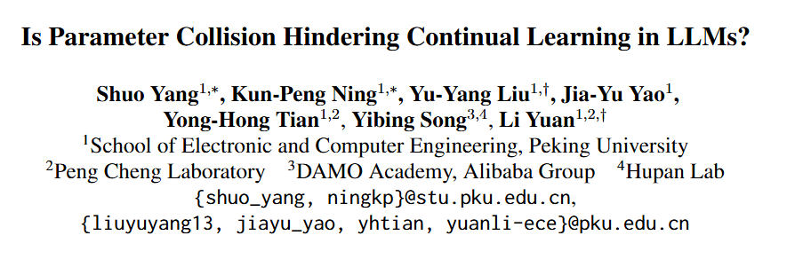
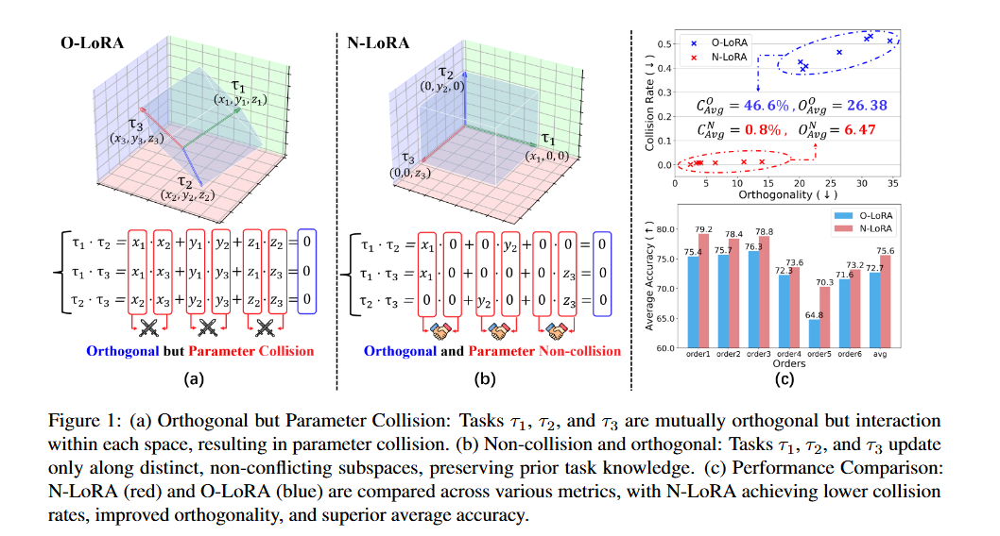
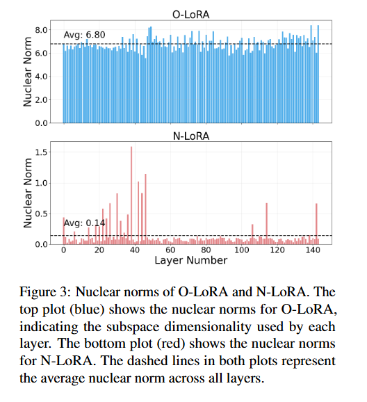
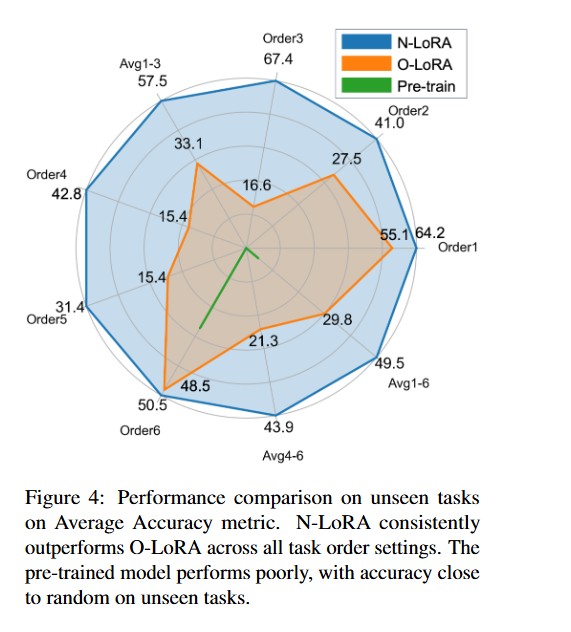
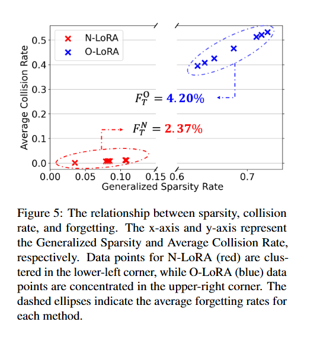
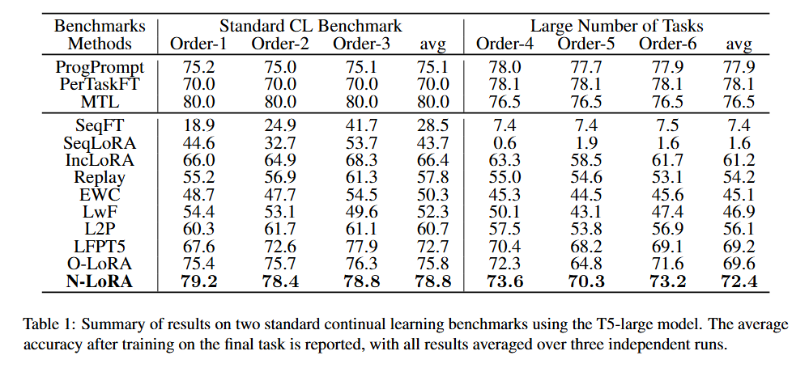
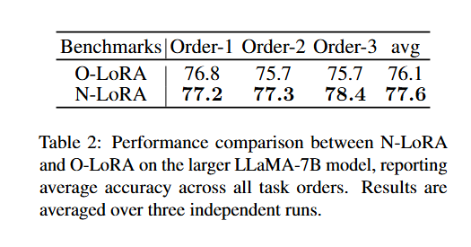
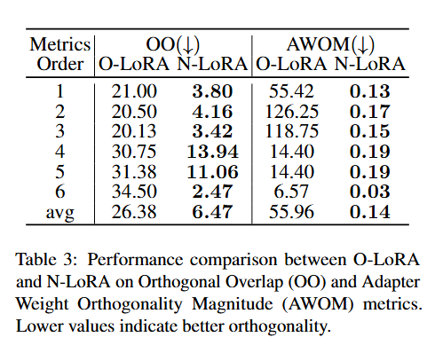
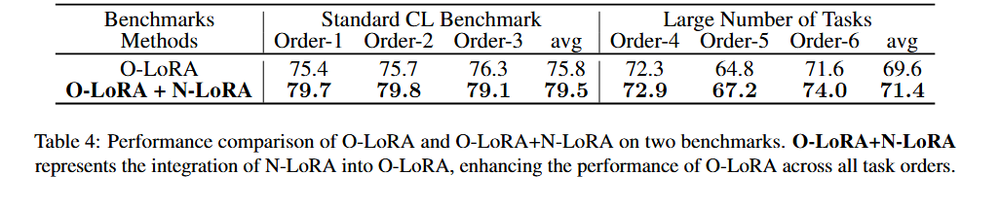
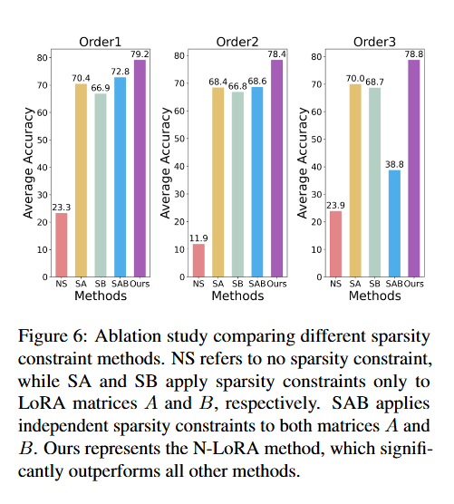

# Is Parameter Collision Hindering Continual Learning in LLMs?


---
## Information



# 论文总结：参数碰撞是否阻碍了LLM的持续学习？

---

## 1. 研究动机 (Motivation)

### 1.1 问题背景

大型语言模型（LLMs）在实际应用中需要不断学习新任务，但面临**灾难性遗忘（Catastrophic Forgetting）**的挑战——学习新任务时会覆盖或遗忘之前学到的知识。

### 1.2 现有方法的不足

当前最先进的方法如 **O-LoRA** 采用**正交梯度下降**来解耦不同任务间的参数依赖。其核心思想是让不同任务的参数向量在空间中相互正交（就像三条互不相交的直线），以避免相互干扰。

### 1.3 核心洞察

作者发现了一个关键问题：**即使参数向量正交了，它们在各自空间中仍然可能产生"碰撞"**。

> **比喻理解**：想象三个人分别住在三栋独立的楼房里（正交）。每栋楼有3层，每层都有住户。当Task 1住在第1层，Task 2住在第2层，Task 3住在第3层时，看似互不干扰。但实际上，同一栋楼的不同层之间可能存在共享的基础设施（如水管、电线），这些共享资源就会产生"碰撞"。O-LoRA的问题就在于此——它只保证了楼与楼之间不相交，却没解决楼内各层之间的共享问题。

因此，作者提出：**解决参数碰撞（非碰撞）比单纯追求正交性更关键**。

---

## 2. 方法总结 (Method Summary)

### 2.1 核心定义

**定义1 - 非碰撞（Non-Collision）**：对于两个参数矩阵 $\Delta W_1$ 和 $\Delta W_2$，如果对于任意位置 $(a,b)$，都有 $\Delta W_1[a,b] = 0$ 或 $\Delta W_2[a,b] = 0$，则称它们是非碰撞的。

**定义2 - 正交（Orthogonal）**：两个参数矩阵如果满足 $\Delta W_1^T \Delta W_2 = 0$，则称它们是正交的。

### 2.2 关键定理

**定理1**：非碰撞是正交的**充分但非必要**条件。

$$非碰撞 \Rightarrow 正交 \quad (充分条件)$$

$$正交 \nRightarrow 非碰撞 \quad (非必要条件)$$

> **通俗解释**：非碰撞的两个矩阵一定是正交的（没有共享参数当然不会相互干扰）。但正交的两个矩阵不一定是非碰撞的（即使点积为0，它们的某些位置仍可能同时非零）。

### 2.3 N-LoRA 方法

**核心思想**：通过 **ℓ₁正则化** 让每个任务的LoRA参数变得**极度稀疏**，从而从根本上减少参数碰撞。

**损失函数**：
$$L = L_{task} + L_{sparse} = L_{t_i} + \lambda \|\Delta W_i\|_1$$

其中 $\lambda$ 是稀疏性超参数，$\|\Delta W_i\|_1$ 是 ℓ₁ 范数（所有参数绝对值之和）。

### 2.4 理论保证

**定理2**（碰撞率与稀疏率的关系）：假设两个 $m \times n$ 参数矩阵的稀疏率分别为 $s_i$ 和 $s_j$，且非零元素独立随机分布，则碰撞率为：

$$CR_{i,j} = s_i \times s_j$$

> **关键推论**：稀疏率翻倍，碰撞率会**下降为原来的四分之一**（二次方下降）。

---

## 3. Figure 分析 (Figure Analysis)

### 3.1 Figure 1 - 核心概念可视化



**图1(a) 正交但有碰撞**：展示了三个任务 $\tau_1, \tau_2, \tau_3$ 在三维参数空间中。虽然任务向量相互正交（蓝色框），但每个向量占据所有三个子空间，红色区域表示参数碰撞。

**图1(b) 非碰撞且正交**：每个任务只在一个独立的子空间中更新，完全避免了碰撞。

**图1(c) 性能对比**：N-LoRA（红色）在所有指标上都优于O-LoRA（蓝色）：
- 更高的任务正交性（×4.1倍）
- 更低的参数碰撞（×58.1倍）
- 更好的平均准确率（+2.9%）

### 3.2 Figure 2 - 参数分布可视化


对比了T5-large模型在Task 1和Task 2上的参数分布：

| 方法 | 准确率 | 正交性值 |
|------|--------|----------|
| O-LoRA | 48.5% | 14.9 |
| N-LoRA | 58.2% | 2.8 |

- **绿色/蓝色**：Task 1和Task 2的参数
- **红色**：碰撞区域
- O-LoRA中红色区域明显更多（大量碰撞）
- N-LoRA红色区域极少（几乎无碰撞）

### 3.3 Figure 3 - 核范数对比



展示了O-LoRA和N-LoRA在各层上的核范数（子空间维度指标）：

- O-LoRA：几乎占满8个子空间，平均6.80
- N-LoRA：仅使用0.14个子空间

> **比喻**：O-LoRA像是在每栋楼的所有楼层都安排了住户，而N-LoRA只让住户集中在1-2层，大幅减少了楼栋间的干扰。

### 3.4 Figure 4 - 泛化能力测试



在未见任务上的表现：
- 预训练模型：接近随机猜测（接近0%）
- N-LoRA：平均49.54%
- N-LoRA比O-LoRA高出**+19.78%**

### 3.5 Figure 5 - 稀疏性、碰撞率与遗忘率的关系




- N-LoRA数据点集中在**左下角**（高稀疏、低碰撞、低遗忘率2.37%）
- O-LoRA数据点集中在**右上角**（低稀疏、高碰撞、高遗忘率4.20%）

---

## 4. Table 分析 (Table Analysis)

### 4.1 Table 1 - 标准CL基准测试结果



| 方法 | Standard CL (avg) | Large Tasks (avg) |
|------|-------------------|-------------------|
| MTL (上界) | 80.0 | 76.5 |
| **N-LoRA (Ours)** | **78.8** | **72.4** |
| O-LoRA | 75.8 | 69.6 |
| L2P | 60.7 | 56.1 |
| EWC | 50.3 | 45.1 |

**关键发现**：
- N-LoRA比O-LoRA提升**+3.0%**
- N-LoRA接近MTL上界（差距仅1.2%）
- 在15个任务的Large Number benchmark上仍保持优势

### 4.2 Table 2 - LLaMA-7B模型结果




| 方法 | 平均准确率 |
|------|-----------|
| O-LoRA | 76.1 |
| **N-LoRA** | **77.6** |

在大模型上同样有效，验证了方法的**可扩展性**。

### 4.3 Table 3 - 正交性指标对比



| 指标 | O-LoRA | N-LoRA | 提升倍数 |
|------|--------|--------|----------|
| OO (↓) | 26.38 | 6.47 | ×4.07 |
| AWOM (↓) | 55.96 | 0.14 | ×388.3 |

N-LoRA在正交性指标上实现了**数量级**的提升。

### 4.4 Table 4 - 即插即用效果



| 方法 | Order-1 | Order-2 | Order-3 | avg |
|------|---------|---------|---------|-----|
| O-LoRA | 75.4 | 75.7 | 76.3 | 75.8 |
| **O-LoRA + N-LoRA** | **79.7** | **79.8** | **79.1** | **79.5** |

N-LoRA可以无缝集成到O-LoRA中，带来**+3.7%**的提升。

---

## 5. 算法分析 (Algorithm Analysis)

### 5.1 N-LoRA 算法流程

```
输入: 预训练模型 W₀, 任务序列 {t₁, t₂, ..., tₙ}
输出: 任务特定参数 {ΔW₁, ΔW₂, ..., ΔWₙ}

For 每个任务 tᵢ do:
    1. 初始化 ΔWᵢ = AᵢBᵢ (低秩分解)
    2. For 每个训练epoch do:
        计算任务损失: L_task = Loss(W₀ + AᵢBᵢ, tᵢ)
        计算稀疏损失: L_sparse = λ ||AᵢBᵢ||₁
        总损失: L = L_task + L_sparse
        反向传播更新 Aᵢ, Bᵢ
    3. 冻结 Aᵢ, Bᵢ
End For
```

### 5.2 消融实验结果



| 方法 | 描述 | 性能 |
|------|------|------|
| NS | 无稀疏约束 | 遗忘严重 |
| SA | 仅约束矩阵A | 部分改善 |
| SB | 仅约束矩阵B | 部分改善 |
| SAB | 同时独立约束A和B | 次优 |
| **N-LoRA** | **联合约束 A×B** | **最优** |

**关键发现**：必须对整个更新矩阵 $\Delta W = AB$ 施加稀疏约束，而非分别对 A 和 B 施加约束，否则会影响梯度流动和全局优化。

### 5.3 复杂度分析

| 操作 | 复杂度 |
|------|--------|
| ℓ₁ 正则化 | $O(mn)$ |
| 前向传播 | $O(mnr)$ (r为秩) |
| 梯度计算 | $O(mnr)$ |

N-LoRA引入的计算开销极小，主要通过稀疏化实现了参数碰撞的指数级降低。

---

## 6. 总结

### 核心贡献

1. **理论洞察**：揭示了非碰撞比正交性更关键——非碰撞是解决持续学习问题的**充分条件**

2. **方法创新**：提出N-LoRA，通过ℓ₁稀疏化从根本上减少参数碰撞

3. **实验验证**：在多个基准上实现SOTA性能，且可作为即插即用模块提升现有方法

### 局限性

- 当任务数量极大（数百或数千）时，参数空间仍可能饱和
- 动态环境和概念漂移场景需要进一步探索

---

> **一句话总结**：N-LoRA通过让每个任务"独占"参数空间的小角落（稀疏化），而非追求任务间的正交性，更有效地解决了LLM持续学习中的灾难性遗忘问题。
