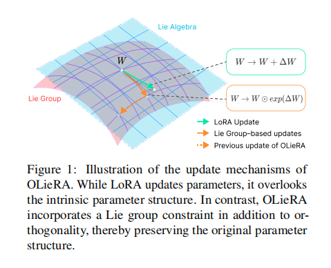
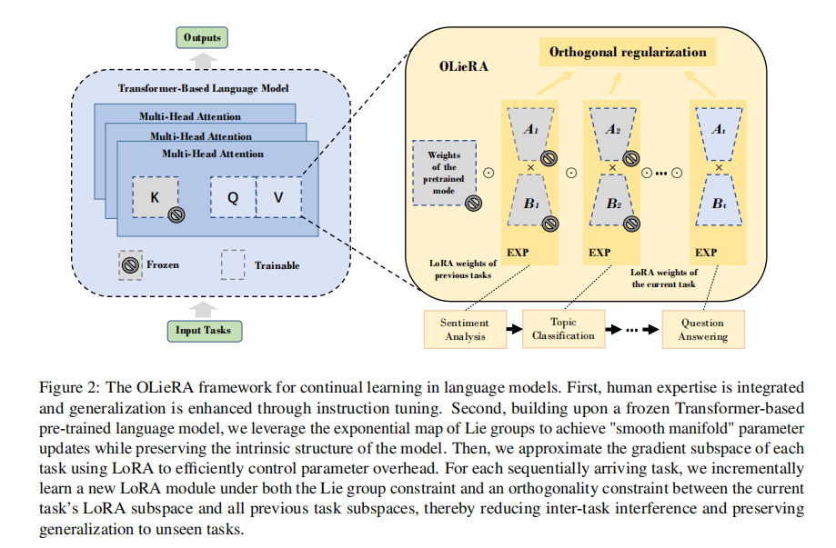
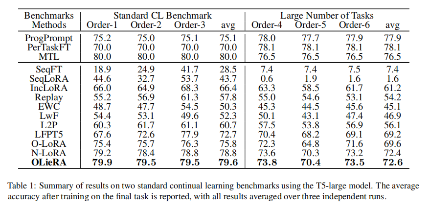
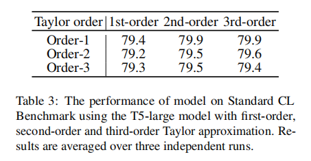
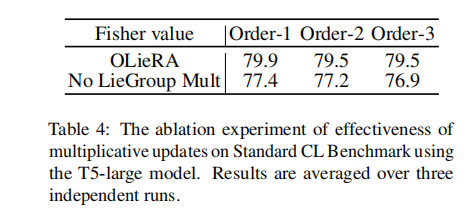
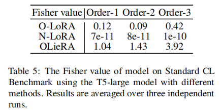

# 默认话题

## 🧑‍💻 User


---
## 🤖 Assistant

# OLieRA: 正交低秩适配在李群中的连续学习

## 动机（Motivation）

**问题背景**：大语言模型在顺序多任务学习中面临灾难性遗忘——学习新任务会严重损害之前任务的性能。

**现有方法的局限**：
- 现有正交低秩方法（如O-LoRA、N-LoRA）使用加法更新（W → W + ΔW），这会扭曲模型参数的内在几何结构
- 就像用直线去近似曲线一样，简单的加法更新忽视了参数空间本身的几何特性

**核心创新**：OLieRA通过李群理论引入乘法更新（W ⊙ exp(ΔW)），在保持参数几何结构的同时，强制执行任务子空间间的正交性约束。这就像在流形上"沿着曲线"移动，而不是"穿过"它。

---

## 方法总结（Method Summary）

### 核心思想
OLieRA结合三个关键要素：

1. **李群框架**：将参数视为李群中的元素，更新在关联的李代数（切空间）中进行
2. **乘法更新**：通过指数映射将李代数中的更新映射回李群，保持参数结构
3. **正交约束**：确保不同任务的参数更新子空间相互正交，减少任务间干扰

### 技术流程

**第一步：低秩分解**
```
ΔW = BA  (B ∈ ℝ^(d×r), A ∈ ℝ^(r×k), r ≪ min(d,k))
```
这与标准LoRA相同，保持参数效率。

**第二步：李群乘法更新**
```
W → W ⊙ exp(ΔW)
```
其中⊙是Hadamard积（逐元素乘法），exp是指数映射。

**第三步：泰勒近似**
由于ΔW很小，使用一阶或二阶泰勒展开：
```
exp(ΔW) ≈ I + ΔW  (一阶)
或
exp(ΔW) ≈ I + ΔW + (1/2)ΔW⊙ΔW  (二阶)
```

**第四步：正交约束**
对所有任务对(i,j)，添加正交损失：
```
L_orth = Σ ||(I + B_i A_i)(I + B_j A_j)^T||_F^2
```
这确保不同任务的完整更新子空间相互正交。

**最终损失函数**：
```
L_total = L_task + λ × L_orth
```

---

## 图表分析（Figure Analysis）


**图1：更新机制对比**



- 左侧（LoRA）：简单加法更新，忽视参数的内在结构
- 右侧（OLieRA）：在李群约束下的乘法更新，保持参数结构的完整性


**图2：OLieRA框架架构**



展示了完整的流程：
1. 冻结的预训练Transformer模型
2. 对每个新任务，学习新的LoRA模块{A_t, B_t}
3. 通过指数映射进行乘法更新
4. 应用正交约束确保任务间独立性
5. 多个任务的LoRA模块通过正交性相互隔离


---

## 表格分析（Table Analysis）


**表1：标准CL基准和多任务场景结果**

**关键发现**：
- OLieRA在标准基准上超越N-LoRA 0.8%，仅比多任务学习上界低0.4%
- 在15任务的长序列场景中保持竞争力，说明方法的可扩展性


**表3：泰勒展开阶数的影响**



- 一阶展开：79.9%
- 二阶展开：79.5-79.6%（最优）
- 三阶展开：79.4-79.5%


**启示**：二阶展开在精度和计算成本间达到最佳平衡。


**表4：乘法更新的必要性**



- 使用乘法更新：79.6%
- 移除乘法更新（仅用加法）：77.2%
- **性能下降2.3%**，证明李群框架的核心价值


**表5：Fisher信息分析**



- O-LoRA: 0.12-0.42
- N-LoRA: 极小值(~10^-11)
- OLieRA: 1.04-3.92

**解释**：OLieRA的较高Fisher值表明它不是简单地避开敏感方向，而是在这些方向上进行**受控更新**，实现更好的参数利用和任务间知识共享。

---

## 算法分析（Algorithm Analysis）

### 核心算法流程

```
输入：预训练模型W，任务序列{D_1, ..., D_T}
初始化：LoRA参数集合 {(A_1,B_1), ..., (A_{t-1},B_{t-1})}

对于每个新任务t：
  1. 初始化新的LoRA参数 A_t, B_t
  2. 在训练过程中：
     a) 计算低秩更新 ΔW = B_t A_t
     b) 应用乘法更新：W_new = W ⊙ exp(ΔW)
     c) 计算任务损失 L_task
     d) 计算正交损失 L_orth（与所有前序任务）
     e) 总损失 = L_task + λ × L_orth
     f) 反向传播更新 A_t, B_t
  3. 固定当前任务的LoRA参数，进入下一任务
```

### 关键优势

1. **参数效率**：每个任务仅添加O(r×d)个参数，r远小于d
2. **隐私友好**：无需存储历史数据，仅保存LoRA参数
3. **任务ID无关**：推理时无需知道任务身份
4. **几何保持**：乘法更新保持参数的内在结构

### 计算复杂度

- 正交约束计算：O(T × r² × d)，其中T是任务数
- 相比完整参数更新，计算开销极小
- 泰勒近似使指数映射可高效计算

---

## 总体评价

OLieRA通过将李群理论与低秩适配结合，提供了一个**几何上合理且实践上高效**的连续学习方案。它的核心贡献在于认识到：保持参数的几何结构与强制任务间正交性同样重要，两者结合才能有效缓解灾难性遗忘。
