# Perception Encoder: 网络最佳视觉嵌入不在输出层

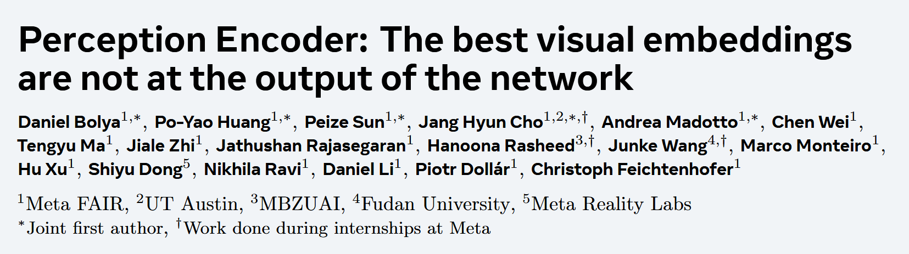

---

## 1️⃣ 细分分类
| 层级分类 | 具体领域 |
|---------|---------|
| 一级领域 | 计算机视觉 |
| 二级领域 | 视觉表征学习 / 视觉基础模型 |
| 三级领域 | 视觉-语言预训练 |
| 核心关键词 | 对比学习、多模态编码器、特征对齐、中间层特征 |


---

## 2️⃣ 研究动机

### 2.1 问题背景

想象一下，你是一位正在学习绘画的学生。传统上，老师会让你专注于画"全局"——比如画一幅完整的风景画。但问题是，当你只关注全局时，你可能会忽略细节：树叶的纹理、人物的表情、物体的边界。
**这正是当前视觉编码器的困境：**
不同预训练目标适合不同下游任务：
- 🎯 **对比学习（如CLIP）**：擅长零样本分类和检索，但空间任务表现差
- 📝 **字幕生成预训练**：适合多模态语言建模
- 🔲 **空间自监督学习（如DINOv2）**：擅长检测、分割等空间任务
- 
### 2.2 核心发现：宝藏藏在中间层
作者发现了一个惊人的事实：
> **一个经过精心调优的对比学习模型，其中间层竟然包含与专门方法媲美的特征！**
就像一座冰山，表面上（输出层）只能看到对比学习的"全局特征"，但水面下（中间层）隐藏着：
- OCR能力 🔤
- 视觉问答能力 ❓
- 定位能力 📍
- 检测能力 🎯
- 深度估计能力 📏

**问题是：这些特征在不同任务上存在于不同的层！**
> 🎭 **比喻**：想象神经网络是一栋大楼，每层楼住着不同技能的"专家"：
> - 30层住着追踪专家
> - 40层住着检测专家
> - 输出层（50层）只住着一个"全局总结员"
> 
> 如果你只看输出层，就错过了所有专家的智慧！

 2.3 研究目标
1. **构建一个强大的对比学习基础模型**（PEcore）
2. **发现并验证中间层的通用特征**
3. **设计方法将这些"隐藏"的特征"提"到输出层**
   - 语言对齐 → PElang（用于多模态LLM）
   - 空间对齐 → PEspatial（用于检测、追踪等）

---

## 3️⃣ 方法总结
### 3.1 整体架构
```
┌─────────────────────────────────────────────────────────────┐
│                    Perception Encoder (PE)                   │
├─────────────────────────────────────────────────────────────┤
│                                                              │
│  ┌──────────────┐    ┌──────────────┐    ┌──────────────┐  │
│  │   PEcore     │───▶│   PElang     │    │  PEspatial   │  │
│  │  (基础模型)   │    │ (语言对齐)    │    │ (空间对齐)   │  │
│  └──────────────┘    └──────────────┘    └──────────────┘  │
│         │                   │                    │          │
│         ▼                   ▼                    ▼          │
│   零样本分类/检索      多模态LLM任务      检测/追踪/深度估计  │
│                                                              │
└─────────────────────────────────────────────────────────────┘
```
### 3.2 PEcore：鲁棒的对比学习预训练
#### 核心训练技巧
| 技巧 | 作用 | 效果 |
|------|------|------|
| **渐进分辨率** | 从98→154→224→336→448逐步提升 | 让模型适应不同尺度，强制学习鲁棒特征 |
| **大批次训练** | 批大小从32K增加到64K | 提供更多难负样本，增加"任务难度" |
| **LAMB优化器** | 支持更高学习率 ($2 \times 10^{-3}$) | 稳定大批次训练 |
| **2D RoPE** | 旋转位置编码 | 改善外推能力 |
| **注意力池化** | 用注意力块构建CLIP嵌入 | 提升特征质量 |
| **数据增强** | 随机裁剪、颜色抖动、水平翻转 | 特别提升ObjectNet性能（+2.4%） |
| **掩码正则化** | 随机掩码1/16的batch | 正则化，保持特征一致性 |

> 🏗️ **比喻**：渐进分辨率就像先画草图（低分辨率），然后逐渐添加细节（高分辨率）。这样模型被迫先理解整体结构，再学习细节特征。
#### 视频数据引擎
**核心创新**：用模型生成视频描述，再用这些描述训练模型
```
┌─────────────┐    ┌─────────────┐    ┌─────────────┐
│ 视频帧      │───▶│ PLM字幕器   │───▶│ 视频描述    │
└─────────────┘    └─────────────┘    └─────────────┘
                         │
                         ▼
┌─────────────┐    ┌─────────────┐    ┌─────────────┐
│ 帧级字幕    │ +  │ 视频元数据  │───▶│ LLM摘要     │
└─────────────┘    └─────────────┘    └─────────────┘
                                              │
                                              ▼
                                       ┌─────────────┐
                                       │ 对齐的字幕  │
                                       └─────────────┘
```
### 3.3 中间层特征发现

**实验设计**：对PEcoreG的每一层进行冻结特征评估

**关键发现**：
- 第32层：追踪任务最优
- 第40层左右：检测、深度估计最优
- 第47层：视觉问答最优
- **最后层（第50层）**：在某些任务上表现极差！
- 
### 3.4 语言对齐（PElang）

**目标**：将中间层的语言相关特征对齐到输出层

**方法**：使用自回归下一token预测进行微调
```
损失函数：L = -∑ log P(y_t | y_{<t}, v)
其中 v 是视觉特征，y_t 是目标token
```
**关键配置**：
- 投影器：2层MLP
- 连接层：第47层（非最后层）
- 正则化：LayerScale + DropPath
- 
### 3.5 空间对齐
**目标**：保留语义信息的同时增强空间定位能力
**发现的问题**：
- 第33层开始出现"全局token"——所有token都关注它们
- 这对语义理解有益，但破坏了空间一致性

- **解决方案**：双重蒸馏
$$\mathcal{L}_{spatial} = \mathcal{L}_{core} + \mathcal{L}_{loc}$$
其中：
$$\mathcal{L}_{core} = \frac{1}{n_{tok}} \sum \frac{(S_{50})(T_{41})^T}{||S_{50}|| \cdot ||T_{41}||}$$
$$\mathcal{L}_{loc} = \frac{1}{n_{tok}^2} \sum \left( \frac{(S_{50})(S_{50})^T}{||S_{50}||^2} - \frac{(T_{SAM})(T_{SAM})^T}{||T_{SAM}||^2} \right)^2$$
> 🎨 **比喻**：$L_{core}$是向"自己老师"学习（保留语义），$L_{loc}$是向SAM学习（学习空间对应关系）。就像学画画，既要向一位画家学构图和色彩（语义），又要向另一位学习精确的笔触技巧（空间）。

---

## 4️⃣ Figure 分析
### Figure 1: 整体架构图

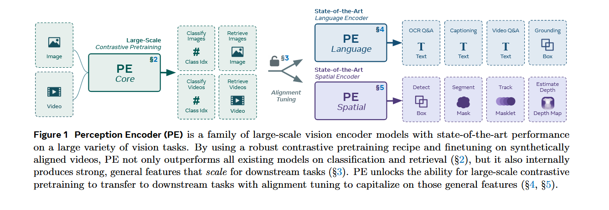

**内容**：展示PE的完整框架，包括三个主要组件

**关键信息**：
- 左侧：PEcore的训练流程（对比学习预训练）
- 中间：各种下游任务的图标展示
- 右侧：两种对齐调优方法（语言对齐、空间对齐）

**设计亮点**：清晰展示了"一个预训练方法 → 多种下游任务"的统一思路

### Figure 2: 鲁棒图像预训练消融

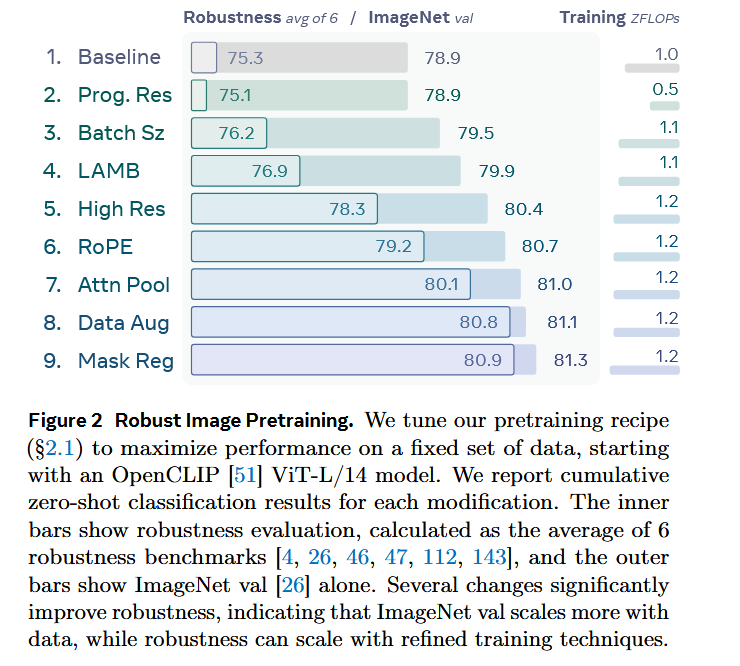

**内容**：展示每个训练技巧对ImageNet和鲁棒性指标的影响

**关键发现**：
- 每个技巧都几乎单调提升性能
- **高分辨率和RoPE对鲁棒性提升最显著**
- 最终从75.3%提升到80.9%（鲁棒性平均）

### Figure 8: 层分析（核心图！）

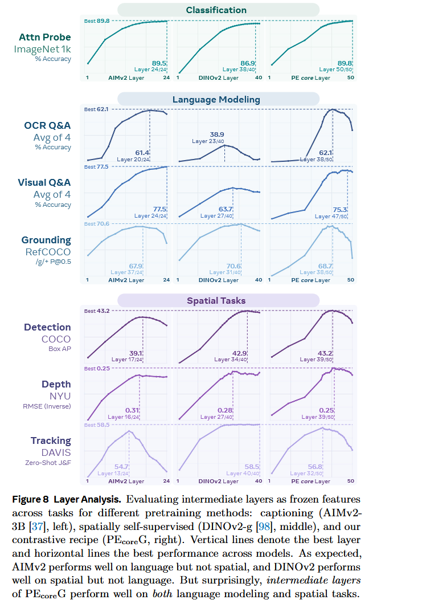

**内容**：比较三种预训练方法（AIMv2、DINOv2、PEcoreG）在不同层的冻结特征性能

**关键洞察**：
| 任务类型 | AIMv2最优层 | DINOv2最优层 | PEcoreG最优层 |
|----------|-------------|--------------|---------------|
| 检测 | 差 | 第40层（58.5） | 第39层（63.7） |
| 深度估计 | 差 | 第27层（0.25） | 第38层（0.31） |
| OCR问答 | 第34层（67.9） | 差（38.9） | 第39层（75.3） |
| 视觉问答 | 第24层（77.5） | 第47层（61.4） | 第47层（68.7） |
| 追踪 | 差 | 第32层（62.1） | 第32层（58.5） |

**核心结论**：
- PEcoreG在几乎所有任务上都有与专门方法媲美的中间层
- 但最后层性能在某些任务上急剧下降

### Figure 9-12: 鲁棒预训练的下游效果

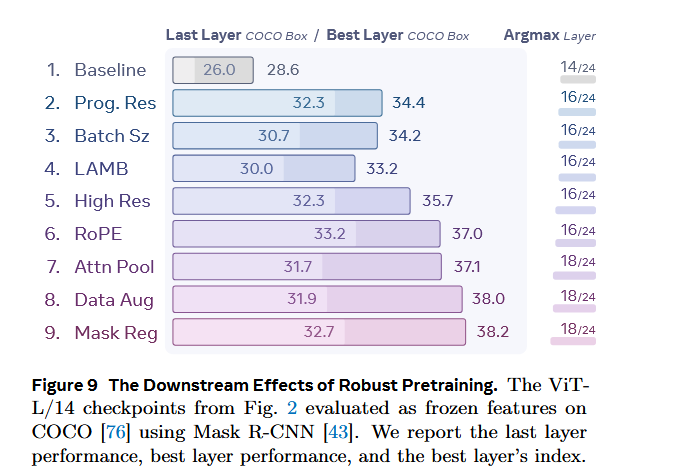

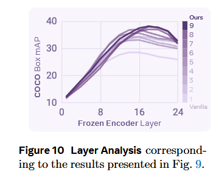

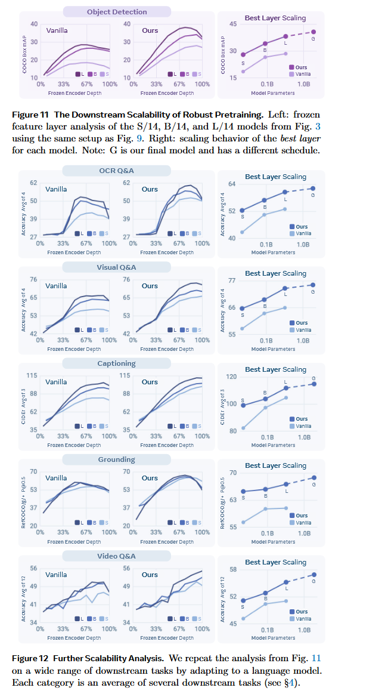

**展示内容**：
- 每个训练技巧如何影响下游任务（检测）
- 模型规模和训练步数的扩展性

- **关键发现**：
- 渐进分辨率、数据增强对空间特征有显著帮助
- 单纯增大批次和学习率（服务于CLIP损失）对下游任务帮助有限
- **验证了鲁棒预训练配方的可扩展性**

### Figure 14-15: 特征可视化分析

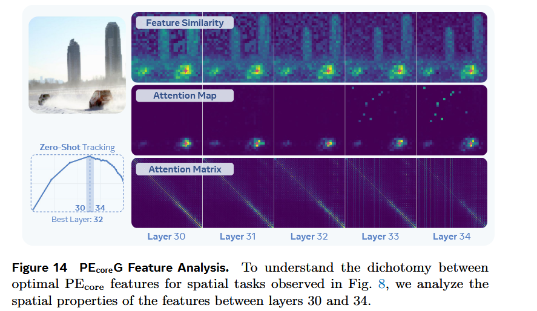

**Figure 14**：展示第30-34层的注意力图变化

**发现**：
- 第32层及之前：注意力保持局部性
- 第33层开始：出现全局token（背景中的垂直线）
> 🔍 **解释**：就像班级里突然出现了几个"中心学生"，所有学生都转向他们。这改变了信息流动方式。

**Figure 15**：SAM 2.1的特征对比

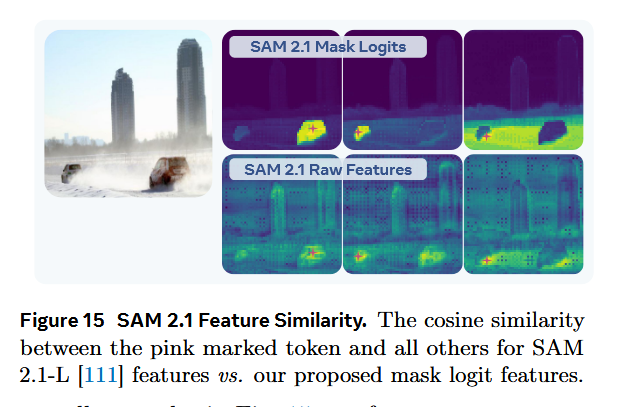

- 原始特征也有全局token问题
- **Mask Logits特征**：没有全局token，空间一致性好

### Figure 16-17: 空间对齐效果

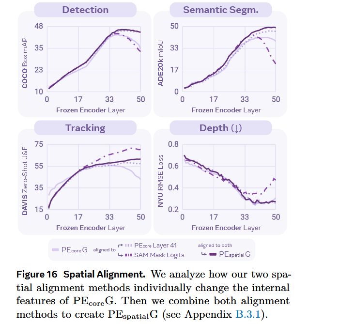

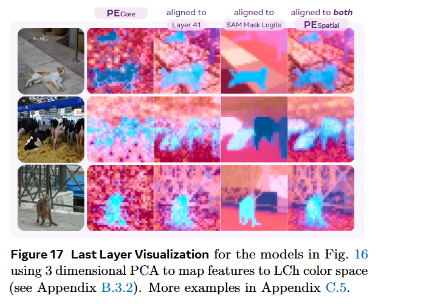

**展示**：四种配置的层分析对比
1. PEcoreG原始
2. 对齐到第41层
3. 对齐到SAM mask logits
4. 两者结合

5. **结论**：结合两种方法才能在所有空间任务上获得最佳且一致的输出层性能

---

## 5️⃣ Table 分析

### Table 5: 零样本图像分类结果

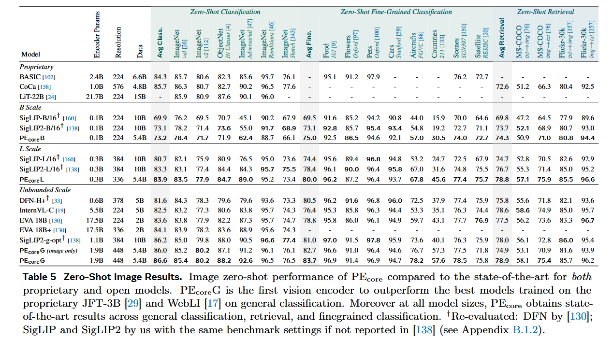

**核心对比**：PEcore vs. SigLIP2、InternVL、EVA等
**关键结果**：
- PEcoreG在**所有**零样本任务上超越其他对比学习模型
- **首次在通用分类上超越使用JFT-3B/WebLI的专有模型**
- 平均鲁棒性：86.6%（超越SigLIP2-g-opt的86.2%）

### Table 6: 零样本视频分类结果

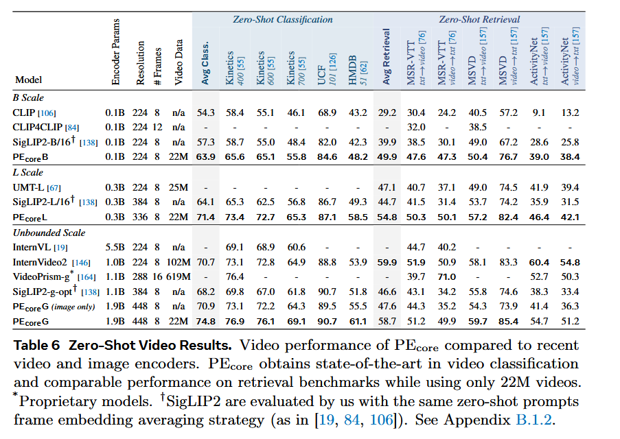

**核心发现**：
- PEcoreG仅用**22M视频**就超越了使用**102M视频**的InternVideo2
- 视频分类：76.9% vs. 73.1%（Kinetics-400）
- 视频检索：58.7% vs. 59.9%
**意义**：证明了视频数据引擎的高效性
#
## Table 10-11: MLLM结果对比
**实验设置**：将不同视觉编码器连接到Llama 3.1 8B或QwenLM 2.5 7B
**关键发现**：
| 模型 | 参数量 | OCR问答平均 | 视觉问答平均 | 视频平均 |
|------|--------|-------------|--------------|----------|
| SigLIP2-g-opt | 1.1B | 56.2 | 77.0 | 54.7 |
| AIMv2 3B | 2.7B | 48.9 | 73.0 | 54.3 |
| **PElangG** | **1.7B** | **72.4** | **78.1** | **56.0** |

**意义**：PElangG用更少的参数，在更多任务上取得更好性能

### Table 12: 系统级MLLM对比

**对比对象**：LLaVA-OneVision、Qwen2-VL、InternVL 2.5/3等

**结果**：PLM-8B（使用PElangG）在几乎所有任务上达到最优
| 任务 | PLM-8B | InternVL 3 8B |
|------|--------|---------------|
| DocVQA | **94.6** | 92.7 |
| InfoVQA | **80.9** | 76.8 |
| PerceptionTest | **82.7** | 75.4 |

### Table 13-15: 空间任务结果
**Table 13（冻结特征）**：
- PEspatialG在追踪（61.5）、分割（49.3）上达到最优
- **最后层性能与最佳层一致**——证明对齐成功！
**Table 15（系统级检测）**：
- COCO检测：**66.0 box mAP**
- 使用更简单的DETA解码器，超越复杂的CoDETR（65.9）

---

## 6️⃣ Algorithm 分析

### 算法1: 鲁棒图像预训练配方
```
输入: 图像-文本数据集 D, 训练预算 F
输出: 预训练的视觉编码器 E
1. 初始化: ViT模型, AdamW优化器
2. 渐进分辨率训练:
   for stage in [98, 154, 224, 336, 448]:
       调整输入分辨率到 stage
       训练 N_stage 个样本
       
3. 应用增强技术:
   - 随机裁剪 scale∈[0.08, 1.0]
   - 颜色抖动 (亮度, 饱和度)
   - 水平翻转 p=0.5
   
4. 掩码正则化:
   对 1/16 的batch进行掩码
   L_mask = 1 - cos_sim(masked_feat, unmasked_feat)
   
5. 总损失:
   L = L_contrastive + λ * L_mask
```
### 算法2: 视频数据引擎
```
输入: 视频集合 V
输出: 对齐的视频-文本数据集
Phase 1: 基础视频字幕器
  训练PLM (PE + Llama) 在图像-视频数据上
Phase 2: 人类精炼
  用PLM生成初始字幕
  人类标注者修正、补充
  用精炼数据微调PLM
Phase 3: LLM摘要
  for each video v:
      frames = 均匀采样8帧
      video_caption = PLM(v)
      frame_captions = [ImageCaptioner(f) for f in frames]
      final_caption = LLM(metadata + video_caption + frame_captions)
```
### 算法3: 空间对齐
```
输入: 预训练的PEcoreG
输出: PEspatialG
初始化: 学生模型S = PEcoreG (可训练)
        教师T_self = PEcoreG第41层 (冻结)
        教师T_SAM = SAM 2.1-L mask logits (冻结)
for each image I:
    # 提取特征
    F_student = S(I)              # 最后一层
    F_self = T_self(I)            # 第41层
    
    # SAM mask logits (32×32网格采样)
    M_SAM = T_SAM(I, grid_points=1024)
    
    # 损失计算
    L_core = -cos_sim(F_student, F_self)
    
    # 空间对应矩阵
    S_matrix = (F_student @ F_student.T) / ||F_student||²
    T_matrix = (M_SAM @ M_SAM.T) / ||M_SAM||²
    L_loc = MSE(S_matrix, T_matrix)
    
    L_total = L_core + L_loc
    
    反向传播更新S
```

---

## 7️⃣ 核心贡献总结
| 贡献 | 内容 | 影响 |
|------|------|------|
| **理论发现** | 对比学习模型中间层包含通用特征 | 打破"对比学习只适合分类"的刻板印象 |
| **方法创新** | 两种对齐调优方法 | 实现一个预训练→多任务应用 |
| **工程实践** | 鲁棒预训练配方 + 视频数据引擎 | 开源SOTA模型 |
| **数据贡献** | PE Video Dataset (1M视频，120K人工精炼) | 促进视频理解研究 |


---

## 8️⃣ 局限性与未来方向

**局限性**：
1. 空间对齐需要SAM作为外部教师，增加了复杂性
2. 不同任务的最优层不同，通用性仍有提升空间
3. 视频数据引擎依赖现有模型的质量

**未来方向**：
1. 探索更统一的对齐方法
2. 研究为何中间层特征如此强大
3. 扩展到更多模态（音频、3D等）

---

## 📌 一句话总结
> **Perception Encoder证明了：用对方法，简单的对比学习也能学到通用特征——关键是要去网络的"中间"找，而不是只看"输出"。**
