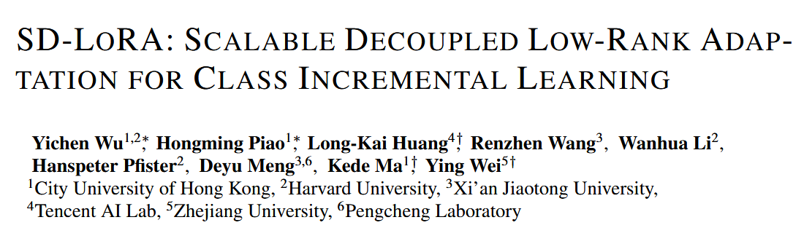
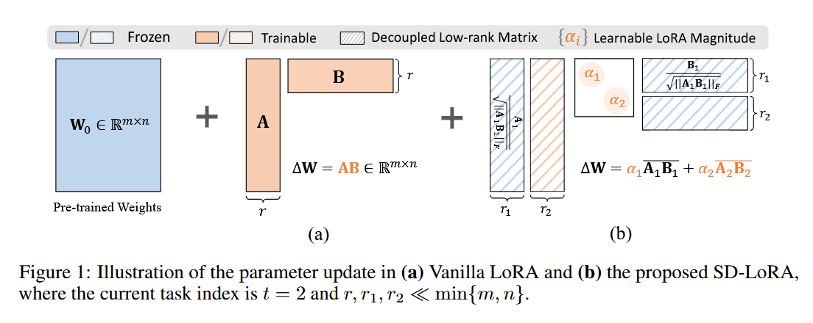
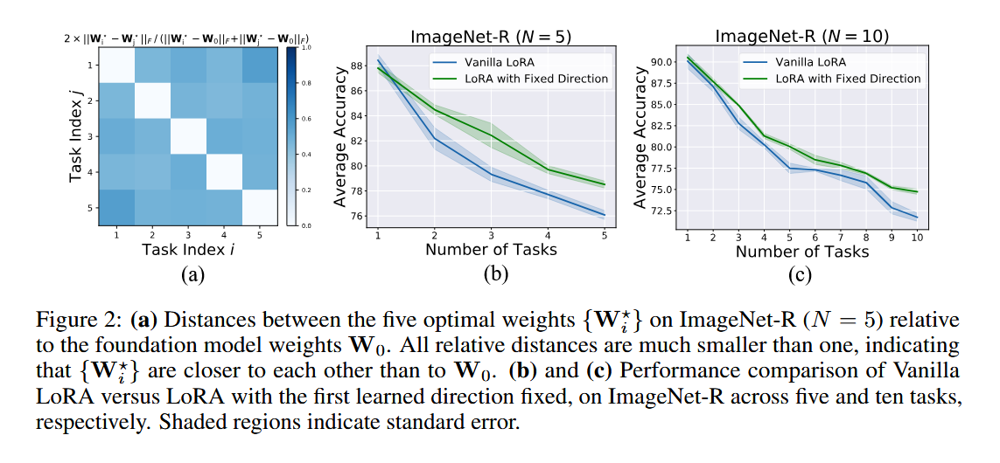
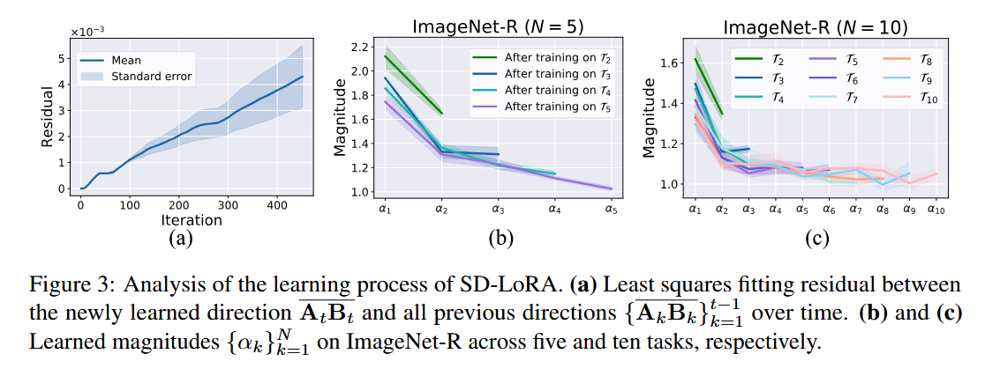
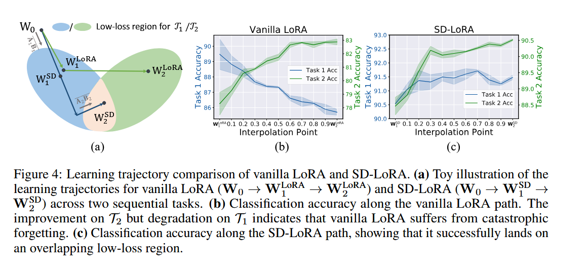
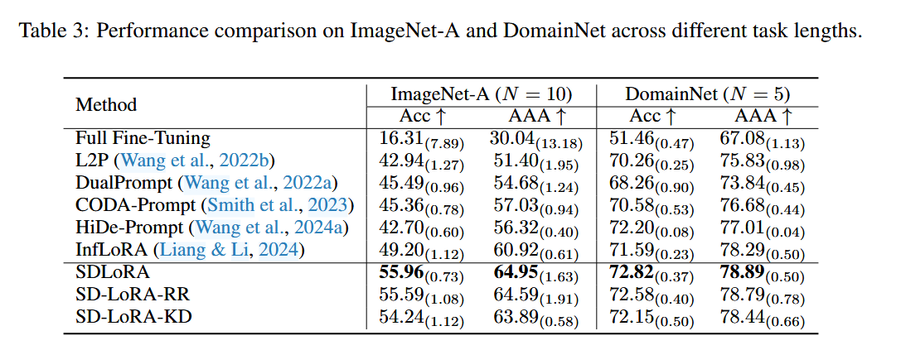

# SD-LoRA 论文总结

## Information




## 一、动机 (Motivation)

### 1.1 持续学习的核心挑战

想象一下人类学习的过程：我们学会骑自行车后，不会忘记如何走路；学会打羽毛球后，还能继续打网球。但神经网络却会遭遇**灾难性遗忘 (Catastrophic Forgetting)**——学习新任务时会把旧任务的知识"覆盖"掉，就像一个学生学了数学就把语文知识全忘了一样。

这篇论文研究的是**类别增量学习 (Class Incremental Learning)**，即模型需要依次学习 N 个任务，最终能够识别所有学过的类别，但测试时不知道当前样本属于哪个任务。

### 1.2 现有方法的三大痛点

论文提出了一个理想的持续学习方法应该具备的**三个核心属性**：

| 属性 | 含义 | 现有方法的困境 |
|------|------|----------------|
| **无需重放 (Rehearsal-free)** | 不能存储旧任务的样本 | HiDe-Prompt、InfLoRA 需要大量存储样本，扩展性差 |
| **推理高效 (Inference Efficient)** | 推理时不能有额外计算开销 | L2P、DualPrompt、CODA-Prompt 需要在推理时做 prompt 选择 |
| **端到端优化 (End-to-end)** | 所有参数联合优化 | 很多方法分阶段优化，性能不最优 |

> **类比**：这就像要求一个餐厅服务员同时做到：记住所有老顾客的喜好（但不能记笔记）、点菜速度要快（不能查电脑）、还要能不断学习新菜品。

### 1.3 LoRA 的潜力与局限

LoRA (Low-Rank Adaptation) 是一种高效的微调方法，将权重更新 $\Delta W$ 表示为两个小矩阵的乘积：

$$
\Delta W = AB, \quad A \in \mathbb{R}^{m \times r}, B \in \mathbb{R}^{r \times n}, \quad r \ll \min(m,n)
$$

论文洞察到：**LoRA 的更新可以进一步分解为"方向"和"幅度"两个部分**：

$$
\Delta W = \|AB\|_F \cdot \frac{AB}{\|AB\|_F}
$$

- **方向 (Direction)**：归一化后的矩阵 $\frac{AB}{\|AB\|_F}$
- **幅度 (Magnitude)**：Frobenius 范数 $\|AB\|_F$

这个发现是 SD-LoRA 的核心灵感来源。

---

## 二、方法总结 (Method Summary)

### 2.1 核心思想：解耦方向与幅度

SD-LoRA 的核心创新是**逐步解耦 LoRA 的方向学习和幅度学习**：

**vanilla LoRA（普通 LoRA）：**
$$
h' = (W_0 + AB)x
$$
所有参数一起训练，每个任务都重新学习方向和幅度 → 容易遗忘

**SD-LoRA：**
$$
h' = (W_0 + \alpha_1 A_1B_1 + \alpha_2 A_2B_2 + \cdots + \alpha_t A_tB_t)x
$$

- **幅度 $\{\alpha_k\}$**：对所有任务都是可学习的，用于调整每个方向的重要性
- **方向 $\{A_kB_k\}$**：一旦学完就**冻结**，不再改变
- **当前任务方向 $A_tB_t$**：是新学习的可训练参数

> **类比**：就像一个人学了很多技能后，不是把旧技能扔掉，而是给它们分配不同的"精力值"（幅度），同时学习新技能。

### 2.2 三个关键发现

通过大量实验，论文发现了 SD-LoRA 有效的原因：

**发现 1：任务特异性权重彼此接近**

不同任务的微调权重在参数空间中比原始预训练权重**更接近彼此**。即使只固定第一个任务学到的方向，模型也能取得不错的性能。

**发现 2：早期方向更重要**

- 早期学到的方向被后续任务**大量复用**
- 新任务的方向逐渐"偏离"早期方向，加入新的变化
- 幅度 $\alpha_k$ 呈现递减趋势：早期任务的幅度大，后期任务的幅度小

**发现 3：低损失路径**

SD-LoRA 找到了一条"低损失路径"——在各个任务的最优解之间存在一个**重叠的低损失区域**，SD-LoRA 通过缩放已有方向来"走"向这个区域。

### 2.3 两个高效变体

#### SD-LoRA-RR (Rank Reduction，秩缩减)

对后期任务使用**更低秩**的 LoRA 矩阵：

$$
r_1 = r_2 = \cdots > r_\mu = r_{\mu+1} = \cdots > r_\nu = r_{\nu+1} = \cdots = r_N
$$

因为后期任务贡献较小，用低秩近似就足够了。

#### SD-LoRA-KD (Knowledge Distillation，知识蒸馏)

用最小二乘法判断新方向能否被旧方向线性表示：

$$
\{\Delta\alpha_k\}^{t-1}_{k=1} = \arg\min_{\{\alpha'_k\}^{t-1}_{k=1}} \left\| A_tB_t - \sum_{k=1}^{t-1} \alpha'_k A_kB_k \right\|_F^2
$$

如果拟合残差小于阈值 $\tau$，就直接把拟合系数加到已有幅度上，**不增加新参数**。

---

## 三、图表分析 (Figure Analysis)

### Figure 1: LoRA vs SD-LoRA 参数更新对比




```
Vanilla LoRA:                    SD-LoRA:
W₀ + AB                          W₀ + α₁A₁B₁ + α₂A₂B₂
│                                 │
└── 可训练 ──┘                    ├── 幅度 α₁, α₂: 可学习
                                  ├── 方向 A₁B₁: 冻结
                                  └── 方向 A₂B₂: 可学习（当前任务）
```

**解读**：Vanilla LoRA 把方向和幅度"捆绑"在一起学习，而 SD-LoRA 将它们"解耦"——方向学完就冻结，幅度持续可调。

### Figure 2: 不同任务权重之间的距离




图中显示：
- 五个任务的最优权重 $\{W^*_i\}$ 相比预训练权重 $W_0$ 的**相对距离都远小于 1**
- 这意味着不同任务的最优权重彼此接近，存在重叠区域

### Figure 3: SD-LoRA 学习过程分析



**(a) 方向拟合残差随时间增加**：
- 初期新方向与旧方向高度一致（可以复用）
- 后期新方向逐渐独立，加入新变化

**(b)(c) 幅度 $\alpha_k$ 递减**：
- 早期任务的 $\alpha$ 值快速上升
- 后期任务的 $\alpha$ 值逐渐下降
- 说明模型越来越依赖早期学到的方向

### Figure 4: 学习轨迹对比（最关键的图！）




```
            低损失区域
           /        \
          /          \
    W₁^LoRA          W₂^LoRA  ← 普通 LoRA 走的是"分叉路"
        \              /
         \            /
          W₁^SD      W₂^SD     ← SD-LoRA 走在"主干道"上
             \      /
              W₀
```

**(b)(c) 性能变化**：
- **普通 LoRA**：改进任务2的性能时，任务1的性能下降（灾难性遗忘）
- **SD-LoRA**：改进任务2时，任务1的性能几乎不变

> **类比**：就像从家去两个不同的地方，普通 LoRA 每次出门只能选一个目的地；SD-LoRA 找到了一条主路，走这条路能同时接近两个目的地。

---

## 四、表格分析 (Table Analysis)

### Table 1: 方法属性对比

| 方法 | 无需重放 | 推理高效 | 端到端优化 |
|------|:--------:|:--------:|:----------:|
| L2P | ✓ | ✗ | ✗ |
| DualPrompt | ✓ | ✗ | ✗ |
| CODA-Prompt | ✓ | ✗ | ✓ |
| HiDe-Prompt | ✗ | ✗ | ✓ |
| InfLoRA | ✗ | ✓ | ✓ |
| **SD-LoRA** | **✓** | **✓** | **✓** |

**结论**：SD-LoRA 是**唯一**同时满足三个属性的方法。

### Table 2: ImageNet-R 实验结果

| 方法 | N=5 | N=10 | N=20 |
|------|-----|------|------|
| Full Fine-Tuning | 64.92 | 60.57 | 49.95 |
| L2P | 73.04 | 71.26 | 68.97 |
| DualPrompt | 69.99 | 68.22 | 65.23 |
| CODA-Prompt | 76.63 | 74.05 | 69.38 |
| HiDe-Prompt | 74.77 | 74.65 | 73.59 |
| InfLoRA | 76.95 | 74.75 | 69.89 |
| **SD-LoRA** | **79.15** | **77.34** | **75.26** |

**关键观察**：
1. SD-LoRA 在所有任务长度上都取得最佳性能
2. 性能优势随着任务数量增加而**扩大**（N=5 时领先 2.2%，N=20 时领先 5.3%）
3. 两个变体 SD-LoRA-RR 和 SD-LoRA-KD 只有轻微性能下降

### Table 3: ImageNet-A 和 DomainNet 结果



- **ImageNet-A (N=10)**：SD-LoRA 达到 55.96% (Acc)，比最佳竞品 InfLoRA (49.20%) 高出 **6.76%**
- **DomainNet (N=5)**：SD-LoRA 达到 72.82% (Acc)，同样最优

### Table 4: 消融实验

| 配置 | N=5 | N=10 |
|------|-----|------|
| $W_0 + \alpha A_1B_1$ | 78.17 | 74.82 |
| $W_0 + \alpha AB$ | 73.24 | 70.62 |
| $W_0 + A_1B_1 + ... + \alpha A_tB_t$ | 78.28 | 74.29 |
| **SD-LoRA (全解耦)** | **79.15** | **77.34** |

**消融结论**：
- 只固定方向不固定幅度 → 效果次优
- 只解耦幅度不添加新方向 → 效果也差
- **完整的 SD-LoRA 需要：多方向 + 独立幅度**

### Table 5: 计算效率对比

| 方法 | GFLOPs | 可学习参数 | 存储特征 |
|------|--------|-----------|---------|
| L2P/DualPrompt/CODA-Prompt | ~70 | 0.06-0.48M | 0 |
| HiDe-Prompt | 70.36 | 0.08M | 0.15M |
| InfLoRA | 35.12 | 0.37M | 0.10M |
| **SD-LoRA** | **35.12** | **0.37M** | **0** |
| **SD-LoRA-RR** | 35.12 | **0.23M** | 0 |

**结论**：SD-LoRA 实现了与 InfLoRA 相同的推理效率（无需 prompt 选择），且 SD-LoRA-RR 进一步减少了参数。

---

## 五、算法分析 (Algorithm Analysis)

### Algorithm 1: SD-LoRA 完整流程

```
输入: 预训练权重 W₀, 当前任务 T_t, 历史方向 {A_kB_k}^{t-1}_{k=1}
输出: 更新的幅度 M 和方向 W

1. 初始化:
   - 初始化 A_t ∈ R^{m×r_t}, B_t ∈ R^{r_t×n}
   - M = {α_k}^t_{k=1}
   
2. 秩缩减 (仅 SD-LoRA-RR):
   if t == μ or ν:
       降低 r_t 到 r_μ 或 r_ν
       
3. 训练循环:
   for iter = 0 to MaxIter:
       计算当前任务上的交叉熵损失
       更新 {α_k}^t_{k=1} 和 A_tB_t (端到端优化)
       
4. 更新方向集合:
   W ← W ∪ {A_tB_t}
   
5. 知识蒸馏 (仅 SD-LoRA-KD):
   求解最小二乘问题获取 {Δα_k}^{t-1}_{k=1}
   if 拟合残差 < τ:
       M ← {α_k + Δα_k}^{t-1}_{k=1}
       W ← {A_kB_k}^{t-1}_{k=1}  # 不添加新方向
```

### 关键数学推导

**Theorem 1 (理论保证)**：

论文证明：使用梯度下降训练 SD-LoRA 时，学习到的矩阵 $A_iB_i$ 会**按顺序**逼近最优更新矩阵 $\Delta W^*$ 的主成分：
$$
\|A_iB_i - \Delta W_{[:k]}^*\| \leq \varepsilon_2\sigma_1 + \varepsilon_1, \quad \forall k = 1,2,...,j
$$

这从理论上解释了：
1. 为什么幅度 $\alpha_k$ 呈现递减趋势（后期主成分已被前面捕获）
2. 为什么固定早期方向是可行的（它们捕获了最重要的变化方向）

---

## 六、总结

### 核心贡献

1. **问题洞察**：发现 LoRA 更新可分解为"方向"和"幅度"，且不同任务的最优权重在参数空间中接近

2. **方法创新**：SD-LoRA 通过**解耦学习 + 方向冻结 + 幅度调整**，找到了一条低损失路径

3. **三个唯一性**：唯一同时满足"无需重放"、"推理高效"、"端到端优化"的方法

4. **两个变体**：SD-LoRA-RR（秩缩减）和 SD-LoRA-KD（知识蒸馏）进一步提升参数效率

### 实验验证

- 在 ImageNet-R/A、DomainNet、CIFAR100、CUB200 等多个数据集上取得 SOTA
- 在 ViT-B/16 和 DINO 两种 backbone 上验证了泛化性
- 任务数量越多，优势越明显
