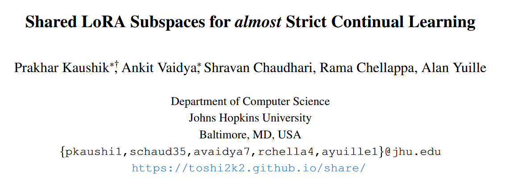
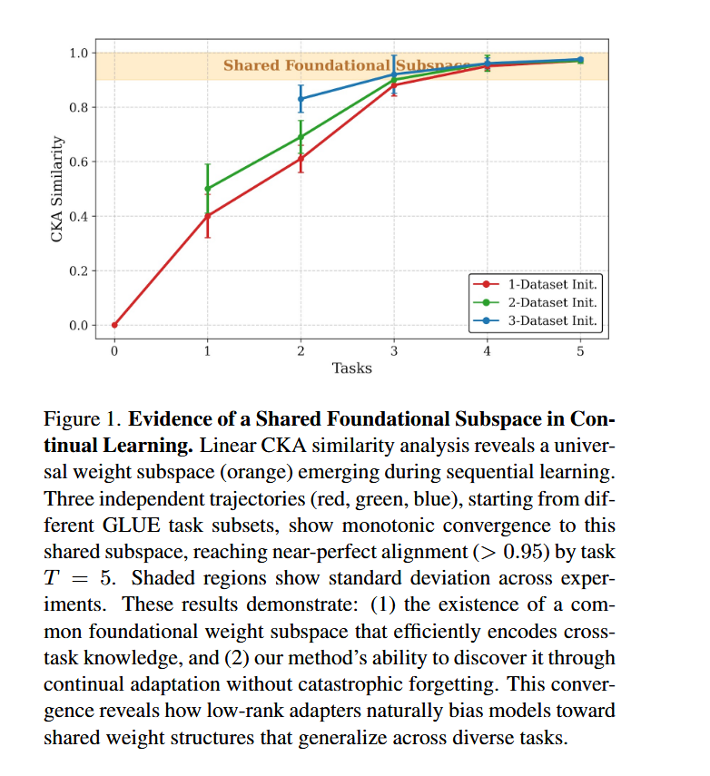
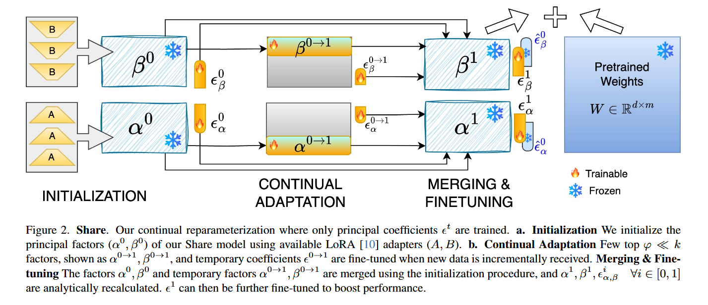
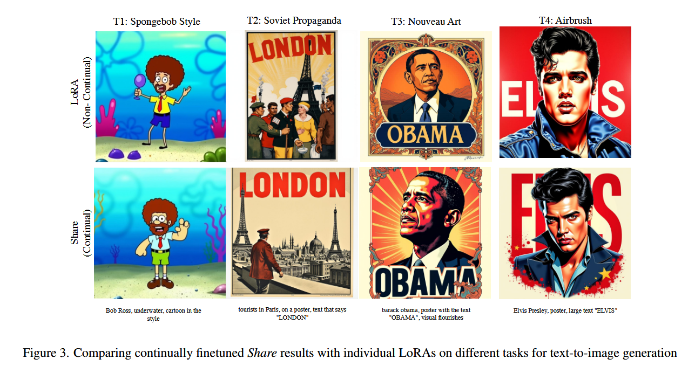
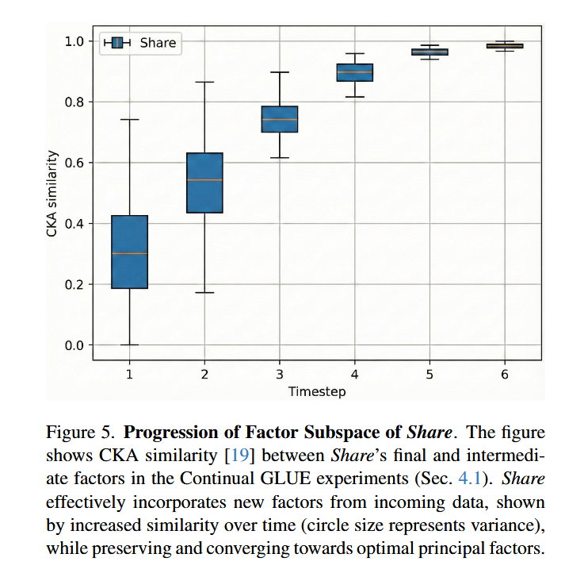

# 论文解读：Shared LoRA Subspaces for almost Strict Continual Learning (Share)



---

## 1. Motivation (研究动机)

### 1.1 问题背景

大型预训练模型（如LLM、VLM、Diffusion模型）在实际应用中面临两个核心挑战：

1. **灾难性遗忘 (Catastrophic Forgetting)**：当模型学习新任务时，会忘记之前学到的知识。就像一个学生学完物理后，把数学知识全忘了一样。

2. **巨大的计算和存储成本**：传统微调需要调整所有模型参数，随着模型规模增大，这种方法变得越来越低效——普通研究者和开发者根本负担不起这样的算力。

### 1.2 现有方法的局限

| 方法 | 问题 |
|------|------|
| 传统LoRA | 每个任务需要单独的适配器，无法跨任务共享知识 |
| O-LoRA等正交方法 | 虽然减少遗忘，但各任务独立训练，浪费了跨任务知识共享的机会 |
| 数据回放方法 | 需要存储历史数据，侵犯隐私且存储成本高 |
| 混合专家模型 | 需要多个模型实例，不符合"严格持续学习"的要求 |

### 1.3 核心洞察

作者提出了一个关键假设：**相似任务和模态的LoRA适配器共享一个公共的低秩子空间**。

> **通俗比喻**：想象所有任务的知识像是一栋大楼的不同房间。虽然每个任务占用不同的房间，但它们都建在同一栋大楼的地基（共享子空间）上。如果我们能找到这个地基，就能用更少的空间存储所有房间的信息！

### 1.4 研究目标

提出Share方法，实现**参数高效的持续微调 (Parameter-Efficient Continual Fine-tuning, PaCT)**，满足近乎"严格持续学习"的要求：
- ✅ 无需数据回放
- ✅ 不增加额外模型
- ✅ 模型大小不增长
- ✅ 可以从LoRA适配器或数据中持续学习

---

## 2. Method Summary (方法总结)

### 2.1 核心思想

Share维持两个关键组件：
1. **主基向量 (Principal Basis Vectors)**：捕获跨任务共享知识的基础子空间，训练时保持冻结
2. **任务特定系数 (Task-specific Coefficients)**：每个任务可学习的小系数

### 2.2 三阶段工作流程

```
┌─────────────────────────────────────────────────────────────────┐
│                    Share 工作流程                                │
├─────────────────────────────────────────────────────────────────┤
│  阶段1: 初始化                                                   │
│  ┌───────────────────────────────────────────────────────────┐  │
│  │ 使用已有LoRA适配器，通过SVD提取主基向量                    │  │
│  │ 建立"共享子空间"的初步框架                                 │  │
│  └───────────────────────────────────────────────────────────┘  │
│                              ↓                                    │
│  阶段2: 持续适应                                                 │
│  ┌───────────────────────────────────────────────────────────┐  │
│  │ 新任务到来时：                                            │  │
│  │ • 仅扩展φ个临时基向量 + 系数                               │  │
│  │ • 在新数据上微调                                          │  │
│  │ • 参数开销远小于LoRA                                       │  │
│  └───────────────────────────────────────────────────────────┘  │
│                              ↓                                    │
│  阶段3: 合并与微调                                               │
│  ┌───────────────────────────────────────────────────────────┐  │
│  │ • 将临时基向量与基础子空间合并                             │  │
│  │ • 通过SVD更新主基向量                                      │  │
│  │ • 解析计算新系数（无梯度）                                 │  │
│  │ • 可选：进一步微调系数优化性能                             │  │
│  └───────────────────────────────────────────────────────────┘  │
└─────────────────────────────────────────────────────────────────┘
```

### 2.3 数学形式化

**初始化的前向传播**：
$$
h_t = W_0 x + (\beta_t \varepsilon_t^\beta)(\alpha_t \varepsilon_t^\alpha)^\top x, \quad \forall x \in S_t
$$

其中：
- $W_0$：冻结的预训练权重
- $\alpha_t \in \mathbb{R}^{d \times k}$：左主基向量
- $\beta_t \in \mathbb{R}^{n \times k}$：右主基向量  
- $\varepsilon_t^\alpha, \varepsilon_t^\beta \in \mathbb{R}^{k \times p}$：任务系数

**参数效率对比**：

| 方法 | 可训练参数 |
|------|-----------|
| LoRA | $(n + d) \times r$ |
| Share | $k \times p$（其中 $p$ 可小至1） |

### 2.4 关键创新点

1. **解析式知识整合**：通过矩阵投影和Moore-Penrose伪逆解析计算系数，无需梯度
2. **双向知识迁移**：不仅实现前向迁移（从旧任务到新任务），还观察到后向迁移（新任务帮助改善旧任务性能）
3. **渐进式子空间发现**：从单一起点逐步发现和完善共享子空间

---

## 3. Figure Analysis (图表分析)

### 3.1 Figure 1：共享子空间的收敛证据




```
图示说明：
    Linear CKA Similarity (相似度)
    │
1.0 ┤           ╭─────╮
    │          ╱       ╲       ← 三条独立轨迹收敛到共同子空间
    │        ╱    ↑     ╲
0.9 ┤      ╱            ╲
    │    ╱              ╲
    │  ╱                 ╲
    │╱                    ╲
    └────────────────────────→ Task T
        0   1   2   3   4   5
    
    橙色区域：共享子空间
    红/绿/蓝线：不同起点出发的学习轨迹
```

**解读**：
- 使用线性CKA（中心核对齐）相似度分析
- 三条独立轨迹（从不同GLUE任务子集出发）都单调收敛到同一个共享子空间
- 到T=5时，相似度超过0.95（近乎完美对齐）
- **意义**：证明了共享子空间假设的正确性，且Share方法能够发现这个子空间

### 3.2 Figure 2：Share方法流程图



```
┌────────────────────────────────────────────────────────────────┐
│                      Share 持续重参数化                         │
├────────────────────────────────────────────────────────────────┤
│                                                                │
│  a. 初始化阶段                                                  │
│  ┌──────────────────┐                                         │
│  │ 使用可用LoRA      │    LoRA适配器 (A, B)                    │
│  │ 提取主因子        │  ──────────────────→ 主因子 (α₀, β₀)    │
│  │ (α₀, β₀)         │                                         │
│  └──────────────────┘                                         │
│                                                                │
│  b. 持续适应阶段                                                │
│  ┌──────────────────────────────────────────────────────────┐ │
│  │ 新数据到来时：                                             │ │
│  │                                                           │ │
│  │   主因子      临时因子      系数                           │ │
│  │  (α₀,β₀)  +  (α₀→₁,β₀→₁) × ε₀→₁  ──→ 更新                │ │
│  │    ↑           ↑              ↑                            │ │
│  │    │           │              │                            │ │
│  │   冻结       可训练        可训练                          │ │
│  └──────────────────────────────────────────────────────────┘ │
│                                                                │
│  c. 合并与微调阶段                                              │
│  ┌──────────────────────────────────────────────────────────┐ │
│  │                                                           │ │
│  │  主因子 + 临时因子  ──→ SVD ──→ 新主因子 (α₁, β₁)        │ │
│  │                                    ↓                      │ │
│  │                              解析计算系数 εᵢ               │ │
│  │                                    ↓                      │ │
│  │                            可选：微调系数                  │ │
│  └──────────────────────────────────────────────────────────┘ │
└────────────────────────────────────────────────────────────────┘
```

**解读**：
- 展示了Share如何处理新任务的完整流程
- 关键思想：**只训练主系数的顶部φ个维度**，大大减少参数量
- 合并阶段使用SVD确保新子空间捕获所有任务信息

### 3.3 Figure 3：文本到图像生成对比



```
┌─────────────────────────────────────────────────────────────────┐
│  Share (持续学习)              vs        LoRA (非持续)           │
├─────────────────────────────────────────────────────────────────┤
│  T1: Spongebob风格                                           │
│  ┌─────────────────────┐      ┌─────────────────────┐          │
│  │ barack obama,       │      │ barack obama,       │          │
│  │ poster with text    │      │ poster with text    │          │
│  │ "OBAMA"...          │      │ "OBAMA"...          │          │
│  └─────────────────────┘      └─────────────────────┘          │
│                                                                 │
│  T2: 苏联宣传风格                                               │
│  ┌─────────────────────┐      ┌─────────────────────┐          │
│  │ Bob Ross, underwater│      │ Bob Ross, underwater│          │
│  │ cartoon style...     │      │ cartoon style...    │          │
│  └─────────────────────┘      └─────────────────────┘          │
│                                                                 │
│  T3: 新艺术风格                                                 │
│  T4: 喷枪艺术风格                                               │
└─────────────────────────────────────────────────────────────────┘
```

**解读**：
- Share能够生成与单独LoRA相当质量的图像
- 关键优势：**一个Share模型替代4个独立LoRA**，实现20倍模型大小缩减
- 证明方法在复杂多模态任务中的有效性

### 3.4 Figure 5：因子子空间的演进



```
    CKA Similarity
    │
1.0 ┤
    │                    ╭──╮
    │                 ╭──╯  ╰──╮          ← 收敛到最优主因子
    │              ╭──╯        ╰──╮
0.8 ┤           ╭──╯              ╰──╮
    │        ╭──╯                    ╰──
    │     ╭──╯                          
0.6 ┤  ╭──╯
    │╭──╯
    └────────────────────────────────→ Time
      T1  T2  T3  T4  T5  T6
```

**解读**：
- Share的因子子空间质量随时间持续改善
- 圆圈大小表示方差（不确定性），显示学习越来越稳定
- 验证了方法在持续学习过程中逐步改进的能力

---

## 4. Table Analysis (表格分析)

### 4.1 Table 1：GLUE基准测试结果

| 方法 | 参数量 | 内存(MB) | CoLA | MRPC | RTE | STS-B | QNLI | SST-2 | **Avg** |
|------|--------|----------|------|------|-----|-------|------|-------|---------|
| Upper Bound | 125M | 500 | 59.91 | 89.01 | 79.70 | 90.90 | 92.31 | 91.28 | 83.90 |
| LoRA (非CL) | 1.2M×6 | 81.6 | 59.56 | 86.76 | 77.61 | 90.81 | 92.53 | 93.35 | 83.43 |
| **Share (CL)** | **0.012M** | **0.29** | 55.99 | 68.38 | 73.29 | 88.91 | 91.95 | 93.58 | **78.69** |
| Share-full | 0.012M | 0.29 | 59.81 | 86.99 | 77.62 | 90.80 | 92.66 | 93.39 | **83.44** |

**关键发现**：
1. **参数量压缩**：Share仅需0.012M参数 vs LoRA的7.2M（6个任务），**实现约600倍压缩**
2. **内存节省**：0.29MB vs 81.6MB，**281倍内存节省**
3. **性能保持**：Share-full达到83.44%平均性能，与LoRA的83.43%几乎持平
4. **后向迁移证据**：CoLA从56.00逐步提升到59.81，说明学习新任务帮助改善旧任务

### 4.2 Table 2：图像分类任务对比

| 方法 | 参数量 | CIFAR-100 | 遗忘率↓ | Food-101 | 遗忘率↓ | Caltech-101 | 遗忘率↓ | Flowers-102 | 遗忘率↓ |
|------|--------|-----------|---------|----------|---------|-------------|---------|-------------|---------|
| Upper Bound | 86M | 94.20 | – | 90.40 | – | 98.32 | – | 98.83 | – |
| DAP | 0.19M | 94.05 | 0.41 | 88.37 | 0.92 | 97.23 | 2.52 | 96.49 | 2.28 |
| **Share** | **0.10M** | **94.20** | **0.40** | **90.10** | **0.70** | **97.70** | **2.18** | **97.90** | **2.33** |

**关键发现**：
1. **性能匹配上限**：Share在CIFAR-100达到94.20%，与全模型微调的上界相同
2. **超越专用方法**：超越DAP等专门为图像分类优化的方法
3. **参数效率最高**：0.10M参数是所有方法中最少的
4. **遗忘率低**：遗忘率与其他最佳方法相当或更低

### 4.3 Table 3：3D姿态估计结果

| 方法 | 参数量 | P3D | L1 | L2 | L3 |
|------|--------|-----|----|----|-----|
| Upper Bound | 30M | 88.10 | 73.20 | 58.40 | 37.80 |
| iNeMO (数据回放) | 25M | 79.28 | 64.71 | 52.26 | 34.01 |
| **Share** | **1M** | **81.80** | **69.11** | **55.60** | **35.50** |

**关键发现**：
1. **遮挡鲁棒性**：Share在所有遮挡级别都优于需要数据回放的iNeMO
2. **96%参数减少**：仅用1M参数达到接近上界性能
3. **跨任务泛化**：从分类任务延伸到复杂的空间推理任务

### 4.4 Table 5：大规模LoRA服务结果

```
T1    T2    T3    T4    T5    T6    T7    T8    T9    T10   T11
T-0  83.70 (1.00)
T-1  82.42 (0.98)  63.34 (1.00)
T-2  79.46 (0.94)  62.29 (0.98)  86.96 (1.00)
...
T-10 76.23 (0.91)  61.52 (0.97)  84.67 (0.97)  ...  42.71 (1.00)
```

**关键发现**：
1. **持续学习稳定**：大多数任务保持90-99%的原始性能
2. **知识保留**：经过10个顺序学习阶段，知识保留率仍然很高
3. **96倍内存节省**：单个Share模型压缩数百个LoRA适配器

### 4.5 Table 7：OOD任务性能

| 方法 | 参数量 | 9个OOD任务平均Rouge-L |
|------|--------|----------------------|
| LoRA (上界) | - | 73.75 |
| TIES (非CL) | - | 21.12 |
| **Share (CL)** | **低** | **55.89** |

**关键发现**：
- Share在分布外任务上显著优于非持续学习方法TIES
- 达到上界LoRA性能的76%，展现了良好的泛化能力

---

## 5. Algorithm Analysis (算法分析)

### 5.1 算法流程 (Algorithm 1)

```
算法1: Share - 基于共享子空间适应的参数高效持续微调

输入: LoRA适配器 {ΔWₜ = (Aₜ, Bₜ)}ᴛ₌₁ 或任务数据 {xₜ}ᴛ₌₁
      超参数: 主因子k, 临时因子φ, 伪秩p

输出: 主因子 αₜ, βₜ, 任务系数 {εₜ}ᴛ₌₁

═══════════════════════════════════════════════════════════════════
阶段1: 初始化 - 提取基础子空间
═══════════════════════════════════════════════════════════════════

IF 有N≥1个LoRA适配器可用 THEN
    1. 提取秩向量:
       D_A = [a₁₁, ..., a_Nᵣ]ᵀ ∈ ℝ^(Nᵣ×d)
       D_B = [b₁₁, ..., b_Nᵣ]ᵀ ∈ ℝ^(Nᵣ×n)
    
    2. 中心化矩阵:
       D_A ← D_A - D̄_A
       D_B ← D_B - D̄_B
    
    3. SVD分解:
       D_A = U_A Σ_A Vᵀ_A
       D_B = U_B Σ_B Vᵀ_B
    
    4. 提取因子:
       α₀ = V_A[:, 1:k]  ∈ ℝ^(d×k)
       β₀ = V_B[:, 1:k]  ∈ ℝ^(n×k)
ELSE
    在第一个任务数据上训练初始LoRA，然后执行上述步骤
END IF

初始化系数: ε₀ᵅ, ε₀ᵝ ~ N(0, σ²) ∈ ℝ^(k×p)

═══════════════════════════════════════════════════════════════════
阶段2: 持续适应 - 处理新任务
═══════════════════════════════════════════════════════════════════

FOR t = 1 to T DO
    IF 收到任务数据 xₜ THEN
        // 临时扩展子空间
        βₜ₋₁→ₜ = βₜ₋₁[:, 1:φ]
        αₜ₋₁→ₜ = αₜ₋₁[:, 1:φ]
        εₜ₋₁→ₜᵅ, εₜ₋₁→ₜᵝ ~ N(0, σ²) ∈ ℝ^(φ×p)
        
        前向传播: h = W₀x + (βₜ₋₁→ₜ εₜ₋₁→ₜᵝ)(αₜ₋₁→ₜ εₜ₋₁→ₜᵅ)ᵀ x
        
        在任务数据xₜ上优化 {βₜ₋₁→ₜ, αₜ₋₁→ₜ, εₜ₋₁→ₜᵅ,ᵝ}
        
        生成任务适配器:
        Âₜ = (αₜ₋₁→ₜ εₜ₋₁→ₜᵅ)ᵀ
        B̂ₜ = βₜ₋₁→ₜ εₜ₋₁→ₜᵝ
    
    ELSE IF 收到LoRA适配器 ΔWₜ THEN
        Âₜ = Aₜ,  B̂ₜ = Bₜ  // 直接集成
    END IF
    
    ════════════════════════════════════════════════════════════════
    阶段3: 合并与微调 - 知识整合
    ════════════════════════════════════════════════════════════════
    
    // 用当前因子重建之前任务适配器
    FOR i = 1 to t-1 DO
        Âᵢ = (αₜ₋₁ εᵢᵅ)ᵀ
        B̂ᵢ = βₜ₋₁ εᵢᵝ
    END FOR
    
    // 构建因子数据矩阵
    Dₜᴬ = [vec(Â₁), ..., vec(Âₜ)]ᵀ
    Dₜᴮ = [vec(B̂₁), ..., vec(B̂ₜ)]ᵀ
    
    // 中心化并SVD
    Dₜᴬ = Uₜᴬ Σₜᴬ Vₜᴬᵀ
    Dₜᴮ = Uₜᴮ Σₜᴮ Vₜᴮᵀ
    
    // 更新主因子
    αₜ = Vₜᴬ[:, 1:k]
    βₜ = Vₜᴮ[:, 1:k]
    
    // 系数重计算（解析）
    FOR i = 1 to t DO
        εᵢᵅ = αₜᵀ Âᵢ
        εᵢᵝ = βₜᵀ B̂ᵢ
    END FOR
    
    // 可选：微调最新系数
    在任务数据上优化 εₜ
END FOR
```

### 5.2 复杂度分析

| 操作 | Share复杂度 | LoRA复杂度 |
|------|------------|------------|
| **训练** | $O(T \cdot n \cdot d \cdot p)$ | $O(T \cdot r \cdot d \cdot m)$ |
| **存储** | $O(k \cdot (d + m) + T \cdot k \cdot p)$ | $O(T \cdot r \cdot (d + m))$ |

其中 $p \ll r$（通常 $p=1$，而 $r \geq 8$），$k \ll r$。

### 5.3 关键数学推导

#### 定理1（增量子空间误差界）

给定累积堆叠的权重矩阵 $D_t = [D_1, D_2, ..., D_t] \in \mathbb{R}^{N_t \times d}$，使用前 $k$ 个主奇异向量作为近似：

$$
\|D_t - \hat{D}_t\|_F^2 = \sum_{i=k+1}^{\min(N_t,d)} (\sigma_i^{(t)})^2
$$

其中 $\sigma_i$ 是 $D_t$ 的奇异值。

> **直观理解**：丢弃的奇异值越小，重构误差越小。Share假设低秩结构存在，因此误差可控。

#### 定理2（泛化误差界）

对于新任务 $\tau_{t+1}$，设 $\varepsilon V_k^T$ 是约束在共享子空间中的解，$D^*$ 是无约束解。在L-Lipschitz强凸损失下：

$$
\|D^* - \varepsilon V_k^T\|_F^2 \leq C_1 \sqrt{\frac{k}{S_{t+1}}} + C_2 \sum_{i=k+1}^{n_{t+1}} \sigma_i^2 + \text{常数项}
$$

> **直观理解**：当新任务主要落在共享子空间（第一项主导）时，Share的约束几乎无代价；当新任务需要子空间外方向时（第二项变大），性能可能下降。

### 5.4 超参数选择指南

| 超参数 | 选择策略 | 典型值 | 说明 |
|--------|---------|--------|------|
| $k$ (主因子数) | 60%解释方差阈值 | 10-32 | 捕获大部分但非全部信息 |
| $p$ (伪秩) | 从1开始 | 1-8 | $p=1$ 已足够有效 |
| $\phi$ (临时因子) | $[1, k/4]$ | 2-4 | 控制新知识获取能力 |

---

## 6. 总结与启示

### 6.1 主要贡献

| 贡献 | 描述 |
|------|------|
| 🔬 **新方法** | Share，首个参数高效持续微调框架 |
| 📊 **极端效率** | 100×参数量减少，281×内存节省 |
| 🧠 **双向迁移** | 前向+后向知识迁移 |
| 🌐 **跨模态验证** | 覆盖图像、NLP、3D、生成模型 |
| ⚡ **异步学习** | 支持大规模LoRA适配器服务 |

### 6.2 实践意义

> **比喻**：把Share想象成一个"知识图书馆管理员"。它不需要保存每本书的完整副本，而是学会识别书籍的"主题因子"——比如爱情、冒险、科幻。当需要某本书时，它通过组合这些主题因子快速重建内容。这不仅节省空间，还能发现不同书籍之间的隐藏联系！

### 6.3 局限性

1. 依赖单一模型架构，无法跨架构整合
2. 仅适配器场景下，初始适配器质量成为性能瓶颈
3. 尚未支持跨任务持续学习

### 6.4 未来方向

- 扩展到多样化的预训练模型整合
- 增强多模态大模型的持续学习能力
- 探索跨任务知识迁移机制

---

这篇论文为大型模型的持续学习提供了一个优雅且实用的解决方案，通过发现和利用任务间的共享低秩结构，实现了参数效率和知识保留的双重目标。
